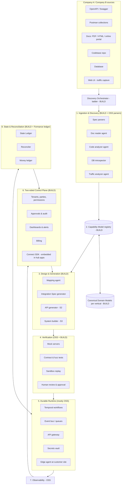

# Agentic B2B Integration Engine — Build Plan

*Version 1.1 · October 2026*

> **v1.1 changes** (details in [design revisions](agentic-integration-engine-design-revisions.md)): hub-and-spoke go-to-market with an embeddable Connect SDK (R1), cross-party State Ledger & Reconciler (R2), Connectivity Ladder with a Discovery Orchestrator (R3), Scenario 3 re-scoped to human-as-API and micro-apps (R4), fintech chosen as the first hub (R5).

---

## 0. Executive summary

We are building a **neutral, two-sided integration platform** that connects two B2B companies regardless of their starting point:

| Scenario | Company situation | What the engine does |
|---|---|---|
| **S1** | Both have APIs | Ingest specs/docs → map A↔B → generate, test, run integration |
| **S2** | One/both have a system but no API | Generate an API from DB, codebase, or UI → then S1 |
| **S3** | One/both have no system | Human-as-API (forms, email, WhatsApp) or a generated micro-app → then S1 |
| **All** | Weak infrastructure | Host and operate a durable runtime (retries, queues, monitoring, security) |
| **All** | Silent drift between parties | Track every shared object in a State Ledger and continuously reconcile both sides |

**Strategy:** use permissive open source for the plumbing (workflows, queues, gateway, observability, secrets). Build natively the things that are the product: the **Capability Model**, the **Integration Spec**, the **mapping agent**, the **codebase→API agent**, the **Discovery Orchestrator**, the **State Ledger & Reconciler**, the **Connect SDK**, and the **two-sided control plane**.

**Go-to-market:** sell to a **hub** (first: fintechs in Egypt, then KSA) that embeds our Connect SDK and brings its many **spokes** (merchants, suppliers) onto the network.

**Rule of thumb:** if a customer would never notice us swapping a component, use open source. If it's the reason they pay us, build it.

---

## 1. Core concepts (the heart of the design)

Everything in the platform revolves around five objects. Getting these right is what makes integration #10 much cheaper than integration #1.

### 1.1 Capability Model (CM)
A normalized, machine-readable description of **what a company's system can do**, independent of how we learned it.

- Entities (Order, Invoice, Shipment, Customer…) with fields, types, constraints
- Operations (create/read/update/list/subscribe) and how to invoke them
- Auth method, rate limits, pagination style, error semantics, events/webhooks
- Provenance for every item: `from_openapi | from_docs | from_code | from_db | from_traffic | human_confirmed` + confidence score

Every ingestion path (Swagger, Postman, PDF docs, codebase, DB, browser traffic) outputs the **same** Capability Model. Everything downstream only reads the CM.

> Internally, the CM can be an OpenAPI 3.1 document plus our own extension fields (`x-entity`, `x-provenance`, `x-confidence`, `x-events`). This gives us free tooling (linting, mocks, SDK gen) while keeping our own semantics.

### 1.2 Canonical Domain Model (per vertical)
A shared vocabulary per industry (e.g. logistics: Shipment, Consignee, Waybill, POD). Each company's CM is mapped to the canonical model once. Then **any two companies already mapped can be connected almost automatically**. This is the network-effect mechanism.

### 1.3 Integration Spec (IS)
Our own **declarative format** describing one integration between A and B. The agent writes it; humans review it; the runtime executes it. Code is the escape hatch, not the default.

```yaml
apiVersion: ie/v1
kind: Integration
metadata:
  name: acme-distributor-to-nile-retail-orders
  parties: [acme, nile]
  vertical: distribution
trigger:
  type: webhook            # webhook | schedule | cdc | poll
  source: nile.order.created
steps:
  - id: fetch_order
    call: nile.orders.get
    with: { id: "{{ trigger.payload.order_id }}" }
  - id: transform
    map: mappings/nile_order_to_acme_salesorder.yaml   # generated by mapping agent
  - id: push
    call: acme.sales_orders.create
    with: "{{ steps.transform.output }}"
    idempotency_key: "nile-{{ trigger.payload.order_id }}"
reliability:
  retry: { max_attempts: 10, backoff: exponential, max_interval: 1h }
  dead_letter: true
  timeout: 5m
  ordering: per_key        # key = order_id
sla:
  max_latency: 2m
  alert_channels: [email:ops@acme.com, email:it@nile.com]
reconciliation:            # v1.1 — see §1.5
  entity: canonical.SalesOrder
  match_on: [external_ids.nile, external_ids.acme]
  track_fields: [status, total_amount, line_items[*].quantity]
  schedule: "*/30 * * * *"
  auto_heal: [missing_at_target, state_mismatch]
```

### 1.4 Connection
A tenant-scoped, credential-bearing link to one company's system (API keys, OAuth, DB credentials, or an **Edge Agent** running in their network). Since v1.1 a connection is chosen **per entity** from the Connectivity Ladder (§3.13) and can be upgraded later without changing the Integration Spec.

### 1.5 Cross-party State (v1.1)
Every business object that crosses between parties has a record in the **State Ledger**: canonical key, state machine, each party's last observed view, and append-only transitions. The **Reconciler** compares both sides against it and raises **breaks** (`missing_at_target`, `state_mismatch`, `value_mismatch`, `orphan_money`, `stale`…). This turns the promise from "we move your data" into "we guarantee both sides agree". Details in §3.14.

---

## 2. High-level architecture



---

## 3. Components — what we build vs. what we take from open source

Legend: **🟢 OSS covers it** · **🟡 OSS + our layer** · **🔴 We build it**

### 3.1 Ingestion & Discovery 🟡

| Input | Approach | Open source to use | We build |
|---|---|---|---|
| OpenAPI / Swagger | Parse, validate, lint, normalize to CM | `@apidevtools/swagger-parser`, **Spectral** (lint), `swagger2openapi` | CM normalizer, enrichment |
| Postman | Convert to OpenAPI, then same path | `postman-to-openapi` / `openapi-to-postman` | Gap filling (examples → schemas) |
| Docs (PDF, HTML, portal) | Agent reads docs, extracts endpoints → draft OpenAPI | **Playwright** (crawl), `unstructured` / **Docling** (PDF parsing) | **Doc reader agent**, confidence scoring |
| Codebase | Static analysis of routes, models, DB access; agent infers business operations | **tree-sitter** (multi-language parsing), framework-specific route extractors | **Code analyzer agent** (see §4.3) |
| Database | Introspect schema, FKs, enums; sample data for semantics | `pg_dump --schema-only`, SQLAlchemy reflection, **SchemaSpy** | Entity inference, PII detection |
| Web UI only | Capture traffic, infer internal API (Integuru-style technique) | **Playwright** (drive UI), **mitmproxy** (capture) | **Traffic analyzer agent** (own implementation — avoid AGPL code) |

**Output:** a Capability Model with provenance and confidence on every field.

### 3.2 Capability Model registry 🔴
- Postgres-backed store of CM versions per company (JSONB + relational index)
- Diffing between versions → detects upstream API changes and triggers re-verification
- Search across all CMs (pgvector for semantic search of fields/entities)
- **OSS used:** PostgreSQL, **pgvector**

### 3.3 Canonical Domain Models 🔴
- One per vertical; start with **one** vertical only
- Seed from existing standards where possible (e.g. GS1 / UBL for orders & invoices, HL7 FHIR for health, EDI X12/EDIFACT segments for logistics)
- Versioned; every company CM gets a stored mapping to the canonical model

### 3.4 Mapping agent 🔴 (core IP)
Proposes how A's entities/fields map to B's (or to canonical).

- Candidate matching: name similarity, embeddings, types, sample values, constraints
- Transformations: unit/currency/date/timezone conversion, enum mapping, splitting/joining fields, lookups
- Output: a mapping file in a declarative transform language
- Every mapping has confidence; low-confidence items go to human review
- **OSS used:** **JSONata** (transform expression language, MIT) as the execution format for mappings; embeddings via pgvector

### 3.5 Integration Spec generator & compiler 🔴
- Agent turns a business intent ("sync new orders from B to A, push shipment status back") + two CMs + mappings → Integration Spec (YAML above)
- Compiler validates the spec against both CMs and compiles it into Temporal workflow definitions
- Escape hatch: a step can be `code:` (TypeScript function) for logic the DSL can't express

### 3.6 API generator — Scenario 2 🟡

| Customer has | Generated API approach | OSS |
|---|---|---|
| Postgres DB | Instant read API + curated write endpoints | **PostgREST** (MIT) |
| Other SQL DB (MySQL, SQL Server, Oracle) | Generated service layer | Our generator + **Prisma** / **Knex** / SQLAlchemy |
| DB changes as events | Change data capture → events | **Debezium** (Apache 2.0) |
| Codebase (business logic) | Agent generates a thin API service that calls their existing code/modules, plus OpenAPI | Framework of their stack (FastAPI, NestJS, Spring, Laravel…) |
| Web UI only | Generated client from traffic analysis, wrapped as API | Playwright, mitmproxy |

Generated APIs are **deployed as part of the Edge Agent** (see §3.9) or in our cloud, always with an OpenAPI spec that goes back into the CM.

### 3.7 Scenario 3 — no system 🔴 (re-scoped in v1.1)
Scenario 3 is no longer a separate "build a system" project. It is the bottom of the Connectivity Ladder:
- **T8a — Human-as-API (Phase 2):** the engine sends tasks (form link, email, WhatsApp) when the spec needs input; an agent parses replies into canonical events with confidence scores. To the Integration Spec it is just a slow connection.
- **T8b — Generated micro-app (Phase 4, optional):** a small app over the canonical entities a counterparty handles (tables, forms, status, export), following the Appsmith / ToolJet / NocoBase pattern. Its API is T1 by construction.
- **OSS candidates:** **Appsmith** (Apache 2.0) as reference or base, or our own generator on **React-Admin / Refine (MIT)**. Avoid BSL/AGPL bases if hosted (see Appendix B).

### 3.8 Verification 🟡

| Check | OSS |
|---|---|
| Mock both sides from CM | **Prism** (Stoplight, Apache 2.0) |
| Property-based / fuzz testing of APIs | **Schemathesis** (MIT) |
| Contract tests between A and B | **Pact** (MIT) |
| Replay real recorded payloads in sandbox | Our replay harness on Temporal |
| Mapping tests | Generated golden-file tests (agent writes fixtures from sample data) |
| Human approval | Our control plane — **both parties approve** before go-live |

**Gate:** no integration goes live without: all tests green + both parties' approval + all low-confidence mappings confirmed.

### 3.9 Durable runtime 🟢 (mostly OSS)

| Concern | OSS | License |
|---|---|---|
| Durable workflows, retries, timeouts, compensation | **Temporal** (self-hosted) | MIT |
| Event bus / queues / replay | **Apache Kafka** (or **NATS JetStream** for smaller footprint) | Apache 2.0 |
| Cache, rate-limit counters | **Valkey** (Redis fork) | BSD |
| API gateway (inbound webhooks, auth, rate limits) | **Kong OSS** or **Envoy** | Apache 2.0 |
| Secrets / credentials | **OpenBao** (Vault fork) | MPL 2.0 |
| Identity / SSO for both parties | **Keycloak** | Apache 2.0 |
| Container orchestration | **Kubernetes** + **Helm** | Apache 2.0 |
| GitOps deploys | **Argo CD** | Apache 2.0 |
| Infrastructure as code | **OpenTofu** (Terraform fork) | MPL 2.0 |

**Edge Agent (we build, small):** a lightweight container we install inside a customer's network when their system is on-prem or behind a firewall. It opens an **outbound-only** encrypted tunnel to our platform, hosts generated APIs (S2), runs CDC (Debezium), and buffers locally if the connection drops. This is what makes weak-infra customers durable without changing their network.

Reliability patterns enforced by the runtime by default:
- Idempotency keys on every write
- Exponential backoff + dead-letter queue + manual replay from UI
- Per-key ordering where required
- Circuit breaker per connection (stop hammering a down system)
- Outbox pattern for events from Edge Agent
- Schema-drift detection (CM diff) → auto-pause + alert + agent proposes fix

### 3.10 Two-sided control plane 🔴
- Multi-tenant: organizations, parties, integrations, connections
- Each integration has **two owners** (A and B) with separate views and permissions
- Onboarding flows: "upload your spec / connect your repo / install edge agent / we build it for you"
- Approval workflow, audit log (who approved what mapping, when)
- Run history, failed runs, replay button, SLA dashboard per integration
- Billing (per integration / per volume / per SLA tier)
- **OSS used:** Keycloak (auth), **React-Admin** or **Refine** (MIT) for admin UI scaffolding

### 3.11 Observability 🟢

| Concern | OSS | License |
|---|---|---|
| Tracing / metrics / logs instrumentation | **OpenTelemetry** | Apache 2.0 |
| Metrics store | **Prometheus** or **VictoriaMetrics** | Apache 2.0 |
| Logs | **Loki** | AGPL — fine for internal use; don't modify & redistribute |
| Traces | **Tempo** or **Jaeger** | AGPL / Apache 2.0 |
| Dashboards | **Grafana** | AGPL — internal use OK; customer-facing dashboards built in our own UI |
| LLM tracing & evals | **Langfuse** (MIT core) | check EE parts |

### 3.12 Agent framework 🟡

| Concern | Options |
|---|---|
| Agent runtime | **Claude Agent SDK** or **LangGraph** (MIT) |
| Tool protocol | **MCP** — expose CM registry, test runner, mock servers, repo access as MCP tools |
| Code-writing agents | Claude Code / similar, run in sandboxed containers |
| Sandboxing generated code | **gVisor** or **Firecracker** (Apache 2.0) |
| Evals | Langfuse + our own eval sets (see §6) |

> ⚠️ **License check before adopting anything.** Licenses change (Redis, Terraform, Vault, Elastic all did). Avoid building the core on ELv2, BSL, SSPL or "Sustainable Use" licenses (e.g. Nango, n8n, Airbyte platform) if we host it for customers. Prefer MIT / Apache 2.0 / BSD / MPL. Verify every license at adoption time.

### 3.13 Discovery Orchestrator & Connectivity Ladder 🔴 (v1.1)
Walks the ladder **per entity** and records the chosen tier in the CM:

| Tier | Method |
|---|---|
| T1 | Official API / webhooks |
| T2 | Docs / Postman → generated client |
| T3 | Database via Edge Agent (+ CDC) |
| T4 | Codebase → generated API |
| T5 | UI traffic → internal API (consented) |
| T6 | Shared external sources (e-invoicing portals ETA/ZATCA, marketplaces, open-banking statements, customs) |
| T7 | Documents (email inbox, Excel, PDF) |
| T8 | Human-as-API / micro-app (§3.7) |

- Same CM output from every tier → same Integration Spec
- Re-runs discovery on schedule or on request; upgrades a connection when a higher tier appears, then the Reconciler confirms nothing changed
- Tier, reliability and latency are shown to the hub and reflected in SLAs

### 3.14 State Ledger & Reconciler 🟡 (v1.1)
- **State Ledger** (🔴): append-only Postgres tables per tenant; every cross-party object, its state machine, each party's observed view, and transitions with run id + payload hash
- **Money ledger** (🟢): double-entry postings for value movements via **Formance Ledger** (open source — verify license)
- **Reconciler** (🔴): scheduled Temporal workflow per integration; pulls both sides, compares, emits breaks; auto-heals only `missing_at_target` and `state_mismatch`, never value fields
- **Ops Agent** consumes breaks and proposes spec/mapping fixes
- **Product surface:** agreement score, shared breaks inbox, signed proof-of-agreement export

### 3.15 Connect SDK 🔴 (v1.1)
- Embeddable `connect.js` widget + hosted connect links (email/WhatsApp) for spokes
- Hub API and webhooks (`connection.ready`, `reconciliation.break`, …)
- White-label, Arabic/English, revocable consent records per hub and scope

---

## 4. The agents in detail

### 4.1 Agent roster

| Agent | Input | Output | Human checkpoint |
|---|---|---|---|
| **Doc Reader** | PDFs, HTML, portal URLs | Draft OpenAPI + confidence | Review low-confidence endpoints |
| **Code Analyzer** | Repo (read-only) | CM: entities, operations, side effects | Engineer confirms operations list |
| **DB Introspector** | DB connection (read-only) | CM entities + sample-based semantics | Confirm PII & entity meaning |
| **Traffic Analyzer** | HAR / captured traffic | CM + client code | Confirm with system owner |
| **Mapping Agent** | Two CMs (+ canonical) | Mapping files (JSONata) | Confirm all mappings < threshold |
| **Integration Designer** | Business intent + CMs + mappings | Integration Spec YAML | Both parties approve |
| **API Builder** (S2) | CM from code/DB | Generated API service + OpenAPI + tests | Code review |
| **Test Author** | Spec + CMs + samples | Contract, fuzz, golden tests | Auto (must pass) |
| **Ops Agent** | Failures, drift alerts, reconciliation breaks | Diagnosis + proposed fix (PR to spec) | Approve fix |
| **Discovery Orchestrator** (v1.1) | Company onboarding inputs | Chosen ladder tier per entity | Confirm tier for low-reliability entities |
| **Document / Reply Parser** (v1.1) | Emails, Excel, PDF, form & chat replies (T7/T8a) | Canonical events + confidence | Review low-confidence events |

### 4.2 Guardrails
- Agents **never** write to customer production directly; they produce artifacts (specs, code, mappings) that go through the verification gate
- Read-only credentials for discovery; write credentials only in runtime
- All generated code runs in sandboxes during testing
- Every agent decision logged with inputs, reasoning summary, and outputs (audit + eval data)
- PII detection and masking before any customer data reaches an LLM; support customer-chosen model hosting for sensitive clients

### 4.3 Codebase → API agent (most novel piece)
1. **Inventory:** tree-sitter parse → languages, frameworks, entry points, existing routes, ORM models, DB access
2. **Behavior extraction:** identify business operations (e.g. `createOrder`, `markShipped`) by tracing service functions and their DB writes
3. **Propose API surface:** a minimal set of operations needed for *this* integration (not the whole system)
4. **Generate:** thin API layer in the customer's own stack, calling existing functions; plus OpenAPI spec
5. **Test:** generate tests against a cloned DB / staging
6. **Deliver:** either as a PR to their repo (they own it) or as a service in our Edge Agent

Start with 2–3 stacks common among target customers (e.g. PHP/Laravel, .NET, Node). Don't promise "any codebase" early.

---

## 5. Recommended tech stack

| Layer | Choice | Why |
|---|---|---|
| Control plane API & workers | **TypeScript (Node)** | Temporal TS SDK, shared types with UI, JSONata native |
| Agent service & code analysis | **Python** | Best ecosystem for parsing, LLM tooling, data |
| Frontend | **React + Refine/React-Admin + Tailwind** | Fast admin-style UI |
| Primary DB | **PostgreSQL + pgvector** | CM registry, tenants, audit, semantic search |
| Workflows | **Temporal** | Durability is the product promise |
| Events | **Kafka** (or NATS JetStream in early stage) | Replay, decoupling |
| Edge Agent | **Go** | Single static binary, small footprint, easy to install on weak infra |
| Infra | Kubernetes, Argo CD, OpenTofu | Standard, portable to any cloud or on-prem |

---

## 6. Quality & evaluation

Agents must be measured, not trusted.

- **Golden datasets:** collect real (anonymized) spec pairs + correct mappings from every integration we ship. This becomes our eval set and our moat.
- **Metrics per agent:**
  - Mapping precision/recall vs. human-confirmed mappings
  - % of fields auto-mapped above threshold
  - Spec generation: % passing tests on first try
  - Code analyzer: % of operations correctly identified
- **Regression:** every model/prompt change runs the full eval suite before deploy
- **Runtime KPIs:** success rate, p95 latency, mean time to detect & recover, # of auto-healed drift events

---

## 7. Coverage map — how much is open source?

| Area | OSS coverage | Notes |
|---|---|---|
| Durable runtime | ~85% | We add Integration Spec compiler + Edge Agent |
| Observability | ~90% | We add customer-facing dashboards |
| Security, identity, secrets | ~85% | We add tenant & two-party permission model |
| Spec ingestion (OpenAPI/Postman) | ~60% | We add CM normalization & enrichment |
| Doc / code / DB / traffic discovery | ~25% | Parsers are OSS; the agents are ours |
| API generation (S2) | ~40% | PostgREST/Debezium for DB; code path is ours |
| Verification | ~60% | Prism, Schemathesis, Pact; we add orchestration & gating |
| Mapping & canonical models | ~10% | Core IP |
| Integration Spec & compiler | ~10% | Core IP |
| Two-sided control plane | ~20% | Auth & UI scaffolding OSS; product logic ours |
| System builder (S3) → micro-apps | ~40% | Frameworks OSS; generator ours |
| State Ledger & Reconciler | ~30% | Formance ledger for money; state ledger & reconciler ours |
| Discovery Orchestrator & Connect SDK | ~10% | Core IP |

**Overall:** roughly **50–60% of the codebase volume comes from open source**, but **~90% of the differentiation is in what we build**.

---

## 8. Roadmap

Timelines assume a core team of 5–7 engineers. Adjust to actual team.

### Phase 0 — Foundations & vertical choice (Weeks 0–4)
- First hub vertical: **fintech / embedded finance in Egypt**; sign 1–2 hub design partners with 10–20 spokes each
- Draft canonical domain model v0 for that vertical
- Define Capability Model schema, Integration Spec v0, and State Ledger schema
- Region-aware tenancy: data residency, e-invoicing connector, tax fields, currency and language resolved per region
- Stand up infra skeleton: Kubernetes, Postgres, Temporal, Keycloak, OpenBao, OTel stack
- **Exit criteria:** design partners signed; CM + IS schemas reviewed

### Phase 1 — MVP: Scenario 1 (Months 2–4)
- Ingestion: OpenAPI + Postman (+ basic doc reader)
- CM registry with versioning and diff
- Mapping agent v1 with human review UI
- Integration Spec generator + compiler → Temporal
- Verification: Prism mocks + Schemathesis + golden tests
- Runtime: retries, DLQ, replay, idempotency, alerts
- Control plane v1: two parties, approvals, run history
- **Connect SDK v1** embedded in the hub's onboarding
- **Reconciler v1**: missing/state breaks, shared breaks inbox (no auto-heal on values)
- One T6 connector: **ETA e-invoicing (Egypt)**
- **Exit criteria:** 1 hub live with ≥20 spokes across ≥3 ladder tiers; ≥60% of fields auto-mapped; ≥99.5% run success; ≥99% agreement score; median spoke onboarding < 1 day

### Phase 2 — Scenario 2: API generation (Months 5–8)
- Edge Agent (Go) with outbound tunnel + local buffering
- DB path: introspection, PostgREST, Debezium CDC
- Code analyzer agent for 2 stacks
- API Builder agent → generated service + OpenAPI + tests
- Traffic analyzer as fallback (consented only)
- Schema-drift detection + Ops Agent proposing fixes
- **Discovery Orchestrator** walking the full ladder; **T7 documents** and **T8a human-as-API**
- Formance ledger for money flows
- **Exit criteria:** 3 integrations live where at least one side had no API, and 1 where one side had no system

### Phase 3 — Network effect & scale (Months 9–12)
- Canonical model coverage complete for the vertical
- "Already on the network" fast path: reuse a spoke's connection for a second hub (with consent) in minutes
- Agreement score and proof-of-agreement export
- Self-serve onboarding for companies with good APIs
- SLA tiers, billing, customer-facing dashboards
- Security hardening: SOC 2 readiness, pen test, data residency options
- **KSA launch:** ZATCA Fatoora connector, in-kingdom deployment, first Saudi hub
- **Exit criteria:** median time-to-live for a network integration < 1 week

### Phase 4 — Scenario 3 & second vertical (Year 2)
- Generated micro-apps (T8b) for counterparties with recurring volume
- Expand to a second hub vertical, e.g. retail buyer or 3PL (new canonical model, reuse everything else)
- Marketplace of verified connectors / company profiles

---

## 9. Team

| Role | Phase 0–1 | Phase 2+ |
|---|---|---|
| Tech lead / architect (distributed systems) | 1 | 1 |
| Backend engineers (TS, Temporal) | 2 | 3 |
| AI / agent engineer (Python, evals) | 1 | 2 |
| Frontend engineer | 1 | 1 |
| Platform / DevOps / SRE | 1 | 1–2 |
| Integration engineers (delivery + golden data) | 1 | 2–3 |
| Domain expert for the chosen vertical | part-time | 1 |

Integration engineers are critical early: they deliver for design partners **and** produce the labeled data that trains and evaluates the agents.

---

## 10. Risks & mitigations

| Risk | Mitigation |
|---|---|
| Becoming a services agency | Track reuse ratio per integration; push all logic into IS/mappings/canonical models; price on recurring runtime, not projects |
| Agent errors corrupting customer data | Read-only discovery, verification gate, two-party approval, idempotency, dry-run mode, easy rollback |
| Security & trust (we touch code and data of two companies) | Edge Agent outbound-only, least privilege, per-tenant encryption, audit log, PII masking, option to self-host LLM |
| License traps | Prefer MIT/Apache/BSD/MPL; legal review of every core dependency; avoid ELv2/BSL/SSPL in hosted core |
| Two-sided cold start (need both A and B to buy) | Hub-and-spoke: the hub pays and embeds the Connect SDK; spokes join free |
| Silent data drift between parties | State Ledger + Reconciler + shared breaks inbox |
| Incumbents (Boomi, MuleSoft, Workato) add similar features | Compete on two-sided neutrality, underserved segment, vertical depth, and network effect, not on features |
| Upstream API changes | CM diffing, scheduled re-ingestion, contract tests in production, Ops Agent auto-proposes fixes |
| "Any codebase" scope explosion | Support named stacks only; expand based on demand |
| LLM cost | Cache CM/mapping results, small models for classification, large models only for design steps |

---

## 11. Key decisions to make now

1. ~~**Which vertical first?**~~ → **Decided in v1.1:** fintech / embedded finance hubs, **Egypt first, KSA in Phase 3** (rationale in design revisions R5)
2. **Cloud vs. on-prem first?** (affects Edge Agent priority)
3. **LLM hosting policy** for sensitive customers (API vs. self-hosted models)
4. **Pricing model:** per integration, per volume, per SLA tier, or hybrid
5. **Ownership of generated code** (S2/S3): customer owns it vs. licensed from us
6. **Ledger scope:** Formance for money only, or for all state? (recommended: Formance for money, own Postgres State Ledger for the rest)
7. **Spoke self-serve view:** free view of their own connections across hubs?

---

## Appendix A — Open source shortlist with licenses

*Verify all licenses at adoption time; they change.*

| Project | Purpose | License |
|---|---|---|
| Temporal | Durable workflows | MIT |
| Apache Kafka | Event streaming | Apache 2.0 |
| NATS / JetStream | Lightweight messaging | Apache 2.0 |
| Valkey | Cache / counters | BSD-3 |
| PostgreSQL | Primary DB | PostgreSQL (permissive) |
| pgvector | Vector search | PostgreSQL |
| Kong OSS / Envoy | API gateway | Apache 2.0 |
| Keycloak | Identity / SSO | Apache 2.0 |
| OpenBao | Secrets | MPL 2.0 |
| OpenTofu | IaC | MPL 2.0 |
| Kubernetes, Helm, Argo CD | Orchestration / deploy | Apache 2.0 |
| OpenTelemetry | Telemetry | Apache 2.0 |
| Prometheus / VictoriaMetrics | Metrics | Apache 2.0 |
| Grafana, Loki, Tempo | Dashboards, logs, traces | AGPL-3.0 (internal use) |
| Jaeger | Tracing | Apache 2.0 |
| Langfuse | LLM tracing & evals | MIT (core) |
| LangGraph | Agent orchestration | MIT |
| swagger-parser, Spectral | Spec parsing & linting | MIT / Apache 2.0 |
| OpenAPI Generator | SDK/server stubs | Apache 2.0 |
| Prism | Mock servers | Apache 2.0 |
| Schemathesis | API fuzz testing | MIT |
| Pact | Contract testing | MIT |
| JSONata | Mapping/transform language | MIT |
| tree-sitter | Code parsing | MIT |
| Docling | Document parsing | MIT |
| Playwright | Browser automation | Apache 2.0 |
| mitmproxy | Traffic capture | MIT |
| PostgREST | DB → REST API | MIT |
| Debezium | Change data capture | Apache 2.0 |
| gVisor / Firecracker | Sandboxing | Apache 2.0 |
| Refine / React-Admin | Admin UI | MIT |
| Formance Ledger | Double-entry money ledger | MIT (verify) |
| Appsmith | Low-code app builder (T8b reference/base) | Apache 2.0 (verify) |

## Appendix B — Use as reference only (don't build core on them)

| Project | Why reference only |
|---|---|
| Nango | ELv2 — restricts offering as a hosted service; good design reference for auth & integration functions |
| Integuru | AGPL-3.0 — learn the traffic-analysis technique, implement our own |
| n8n | Sustainable Use License — not for hosted commercial use |
| Airbyte (platform) | ELv2 — check connector licenses individually |
| Directus / NocoDB | Check current terms before using in S3 templates |
| ToolJet / NocoBase | AGPL — reference for T8b micro-app pattern |
| Tray Embedded | Closed source — reference for the embedded Connect UX |
