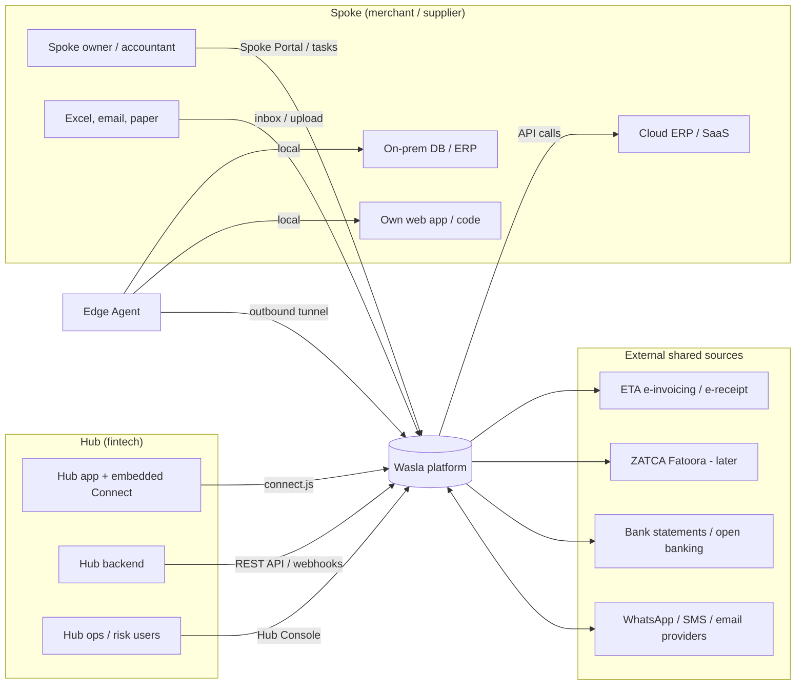
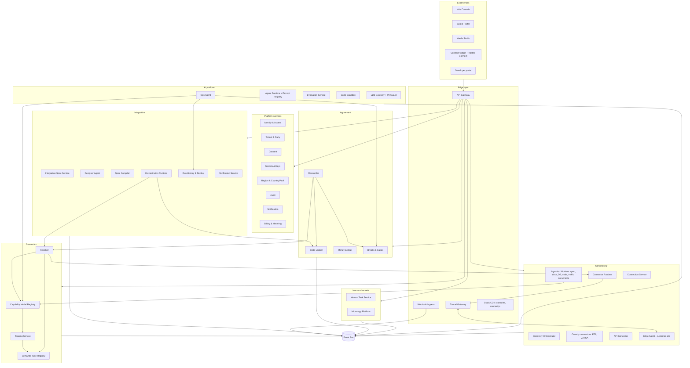
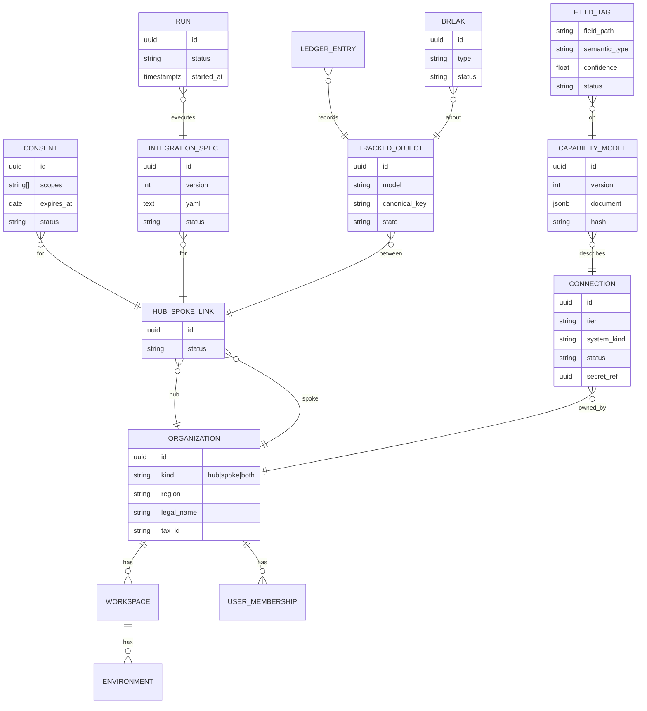
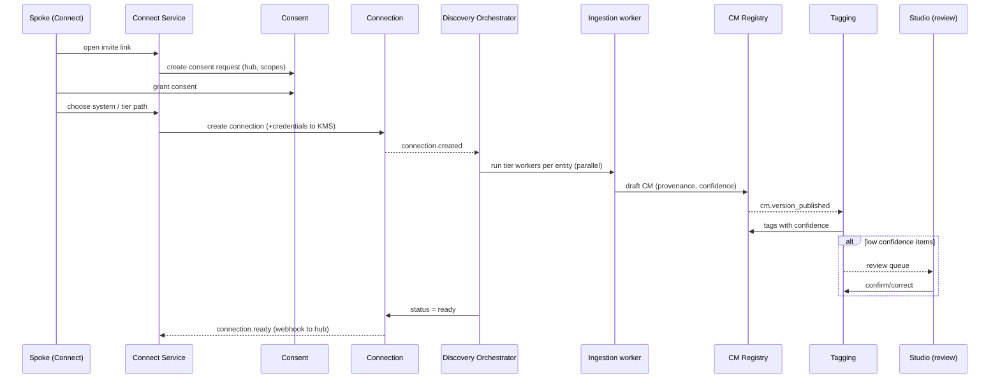
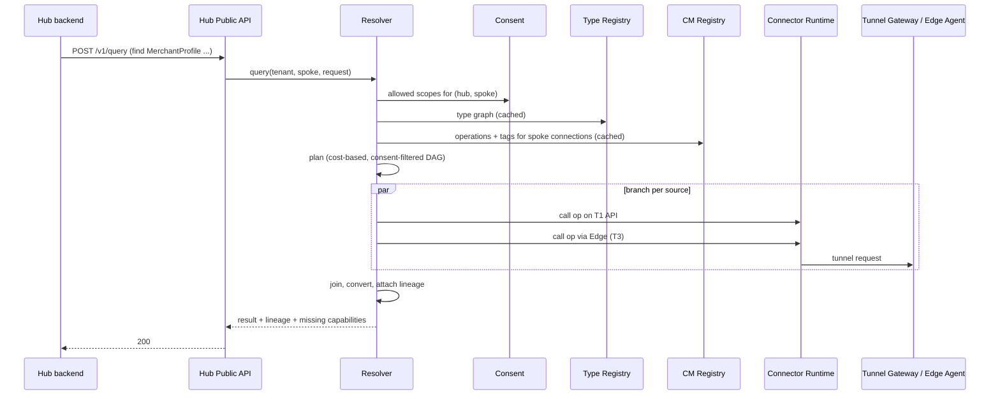

# 02 — Detailed Architecture

*Version 2.0 · October 8, 2026 · Companion to [01-prd.md](01-prd.md)*

---

## 1. Architecture principles

1. **One model in the middle.** Every ladder tier produces the same Capability Model; everything downstream reads only the CM and semantic types.
2. **Meaning over mapping.** Fields are tagged with semantic types; the Resolver composes sources. Pairwise mappings exist only for true conversions.
3. **Durable by default.** Every side-effect runs inside a durable workflow with idempotency keys. Nothing important lives only in memory.
4. **Prove, don't assume.** Every cross-party object is tracked in the State Ledger and reconciled.
5. **Agents propose, gates decide.** Agents produce artifacts (CMs, tags, specs, fixes); verification and humans approve. Agents never write to customer production directly.
6. **Tenant and region isolation first.** Tenant id and region are on every request, row, event, log line, and key.
7. **Outbound-only into customer networks.** The Edge Agent dials out; Wasla never needs inbound firewall rules.
8. **Events as the backbone.** Services communicate through commands (sync API) and domain events (async). Each service owns its data.
9. **Built in-house, infrastructure as commodity.** Product logic is ours. We rely on commodity infrastructure only: PostgreSQL, a Kafka-compatible event log, Redis-compatible cache, object storage, Kubernetes, and a durable-workflow engine (Temporal). Each is wrapped behind an internal interface so it can be replaced.

---

## 2. System context



---

## 3. Logical architecture



### 3.1 Service catalog (summary)

Full specification of each service in [03-services.md](03-services.md).

| # | Service | Domain | Lang | Store | Phase |
|---|---|---|---|---|---|
| S01 | API Gateway | Edge | Go | Redis | 0 |
| S02 | Webhook Ingress | Edge | Go | Event bus, object store | 1 |
| S03 | Tunnel Gateway | Edge | Go | Redis | 1 |
| S04 | Identity & Access (IAM) | Platform | TS | Postgres | 0 |
| S05 | Tenant & Party | Platform | TS | Postgres | 0 |
| S06 | Consent | Platform | TS | Postgres | 1 |
| S07 | Secrets & Keys (KMS) | Platform | Go | Postgres + HSM/KMS root | 0 |
| S08 | Region & Country Pack | Platform | TS | Postgres | 1 |
| S09 | Audit | Platform | Go | Postgres (append-only) + object store | 0 |
| S10 | Notification | Platform | TS | Postgres | 1 |
| S11 | Billing & Metering | Platform | TS | Postgres | 1 (metering) / 3 (billing) |
| S12 | Connection Service | Connectivity | TS | Postgres | 1 |
| S13 | Discovery Orchestrator | Connectivity | TS | Postgres + workflows | 1 |
| S14 | Spec Ingestor (T1) | Connectivity | TS | Object store | 1 |
| S15 | Doc Reader (T2) | Connectivity | Python | Object store | 2 |
| S16 | DB Introspector (T3) | Connectivity | Python | Object store | 1 |
| S17 | Code Analyzer (T4) | Connectivity | Python | Object store | 2 |
| S18 | Traffic Analyzer (T5) | Connectivity | Python | Object store | 2 |
| S19 | Document Extractor (T7) | Connectivity | Python | Object store | 1 |
| S20 | Connector Runtime | Connectivity | TS | Redis | 1 |
| S21 | Country Connectors (T6) | Connectivity | TS | Postgres | 1 (ETA) / 3 (ZATCA) |
| S22 | Edge Agent | Connectivity | Go | Local SQLite buffer | 1 |
| S23 | API Generator (S2) | Connectivity | Python + TS | Object store, Git | 2 |
| S24 | Capability Model Registry | Semantics | TS | Postgres (JSONB) | 1 |
| S25 | Semantic Type Registry | Semantics | TS | Postgres + Git | 0 |
| S26 | Tagging Service | Semantics | Python | Postgres + vectors | 1 |
| S27 | Resolver | Semantics | TS | Redis cache | 0 (prototype) / 1 |
| S28 | Integration Spec Service | Integration | TS | Postgres + Git | 1 |
| S29 | Designer Agent | Integration | Python | — | 2 |
| S30 | Spec Compiler | Integration | TS | — | 1 |
| S31 | Orchestration Runtime | Integration | TS | Temporal + Postgres | 1 |
| S32 | Run History & Replay | Integration | TS | Postgres (partitioned) + object store | 1 |
| S33 | Verification Service | Integration | TS | Object store | 1 |
| S34 | State Ledger | Agreement | Go | Postgres (partitioned, append-only) | 1 |
| S35 | Money Ledger | Agreement | Go | Postgres (append-only) | 2 |
| S36 | Reconciler | Agreement | TS | Postgres | 1 |
| S37 | Breaks & Cases | Agreement | TS | Postgres | 1 |
| S38 | Human Task Service | Human | TS | Postgres | 2 |
| S39 | Micro-app Platform | Human | TS | Postgres (per-app schema) | 4 |
| S40 | LLM Gateway + PII Guard | AI | Python | Redis, Postgres | 0 |
| S41 | Agent Runtime + Prompt Registry | AI | Python | Postgres | 0 |
| S42 | Evaluation Service | AI | Python | Postgres + object store | 1 |
| S43 | Code Sandbox | AI | Go | — | 2 |
| S44 | Ops Agent | AI | Python | Postgres | 2 |
| S45 | Hub Public API (BFF) | UX | TS | — | 1 |
| S46 | Console BFF (Hub Console, Spoke Portal, Studio) | UX | TS | — | 1 |
| S47 | Connect Service (widget + hosted) | UX | TS | Postgres | 1 |
| S48 | Developer Portal | UX | TS (static) | — | 1 |
| S49 | Search Service | Platform | TS | Postgres FTS + vectors | 2 |
| S50 | Observability Platform | Ops | — | Metrics/logs/traces stores | 0 |

---

## 4. Data architecture

### 4.1 Ownership
Each service owns its tables in its own Postgres schema (logical database per service). No cross-service joins; data needed elsewhere is obtained by API or by consuming events into a local read model.

### 4.2 Core entities (owner → key fields)



### 4.3 Stores
| Store | Use |
|---|---|
| PostgreSQL (per region, HA, PITR) | All transactional data; JSONB for CMs/specs; partitioned tables for runs and ledger |
| Vector index (pgvector-style column in Postgres) | Field/type embeddings for tagging and search |
| Object storage (S3-compatible, per region) | Raw ingested artifacts (specs, docs, HAR, uploads), run payloads (encrypted), exports |
| Event log (Kafka-compatible) | Domain events, CDC streams, webhook ingress buffer |
| Redis-compatible cache | Rate limits, resolver cache, sessions, tunnel routing |
| Temporal | Durable workflow state for discovery, runs, reconciliation, human tasks |
| Git (internal) | Type libraries, spec history, generated code |

### 4.4 Event catalog (topics)
Naming: `<domain>.<entity>.<event>.v<N>`; key = `tenant_id:<entity_id>`; envelope includes `event_id`, `tenant_id`, `region`, `occurred_at`, `actor`, `trace_id`, `schema_version`.

| Topic | Producer | Main consumers |
|---|---|---|
| `tenant.org.created/updated` | Tenant | IAM, Billing, Audit |
| `tenant.hubspoke.linked/unlinked` | Tenant | Consent, Connect, Billing |
| `consent.granted/narrowed/revoked` | Consent | Resolver, Connection, Orchestration, Audit |
| `connection.created/status_changed/health_changed` | Connection | Discovery, Hub API (webhooks), Notification |
| `discovery.started/tier_selected/completed/failed` | Discovery | CM Registry, Studio, Notification |
| `cm.version_published` / `cm.diff_detected` | CM Registry | Tagging, Spec Service, Ops Agent |
| `tags.proposed/confirmed` | Tagging | CM Registry, Resolver cache, Evaluation |
| `types.library_published` | Type Registry | Tagging, Resolver |
| `spec.submitted/approved/activated/paused` | Spec Service | Compiler, Orchestration, Notification |
| `run.started/step_completed/succeeded/failed/dead_lettered` | Orchestration | Run History, State Ledger, Metering, Ops Agent |
| `ledger.object_transitioned` | State Ledger | Reconciler, Hub API |
| `money.posted` | Money Ledger | Reconciler, Billing (none), Hub API |
| `recon.completed` / `recon.break_detected/resolved` | Reconciler / Breaks | Breaks, Notification, Ops Agent, Hub API |
| `task.created/sent/answered/expired` | Human Task | Orchestration, Notification |
| `edge.agent_connected/disconnected/updated` | Tunnel Gateway | Connection, Notification |
| `webhook.received` | Webhook Ingress | Orchestration triggers |
| `usage.recorded` | All metered services | Billing |
| `audit.recorded` | All | Audit |

---

## 5. Key flows

### 5.1 Spoke onboarding and discovery


### 5.2 Query by meaning


### 5.3 Integration run with ledger
1. Trigger (webhook/schedule/CDC/API) → Orchestration starts workflow `run(spec_version, trigger_payload)`.
2. Each step is an activity: `find`/`write` via Resolver, `map` via conversion engine, `human` via Human Task Service, `code` via Sandbox.
3. After each state-changing step, Orchestration calls State Ledger `transition(object_key, from, to, run_id, payload_hash)`; money effects call Money Ledger `post(entries)`.
4. Failures → retry policy → DLQ → `run.dead_lettered` → Ops Agent + notification.
5. Run History stores step records (masked) for UI and replay.

### 5.4 Reconciliation
1. Scheduled workflow per integration (`recon(spec_id)`), cursor-based over State Ledger objects within lookback.
2. For each batch: Resolver fetches current views from each party (cached, rate-limited); compares tracked fields with tolerance.
3. Emits breaks; applies auto-heal policy (replay run / re-sync state) for allowed types.
4. Updates agreement score; publishes `recon.completed`.

### 5.5 Drift
1. Discovery re-runs on schedule or on connector errors (e.g. 4xx schema errors).
2. CM Registry diffs versions → classifies changes (additive, breaking, semantic).
3. Breaking → Spec Service pauses affected specs; Ops Agent proposes fix; on approval, specs resume, paused runs replay.

### 5.6 Human task (T8a)
1. Step `human` → Human Task Service creates task with typed schema and channel preference.
2. Sends WhatsApp template / email with link to short form (or accepts free-text reply).
3. Reply → parser (LLM + rules) → typed values + confidence → validation → signal back to workflow.
4. Expiry → reminders → escalation → step fails per policy.

---

## 6. Edge Agent architecture

```
┌──────────────────────── Customer network ────────────────────────┐
│  Edge Agent (single Go binary, Windows service / systemd)         │
│  ├─ Tunnel client  ── outbound TLS 1.3 / mTLS, HTTP/2 multiplex ──┼──▶ Tunnel Gateway (Wasla)
│  ├─ Command router (signed commands only)                         │
│  ├─ DB drivers: SQL Server, MySQL, PostgreSQL, Oracle (P1)        │
│  ├─ CDC readers (log-based or watermark polling)                  │
│  ├─ File watcher (shared folders, exports)                        │
│  ├─ Generated API host (S2 services as sandboxed plugins)         │
│  ├─ Local buffer (SQLite, encrypted) + outbox                     │
│  ├─ Policy engine (allow-listed tables/ops, read-only default)    │
│  ├─ Local audit log (viewable by customer IT)                     │
│  └─ Auto-updater (signed releases, staged rollout, rollback)      │
└───────────────────────────────────────────────────────────────────┘
```

- Enrollment: one-time token from Connect → agent generates key pair → CSR signed by Wasla CA → mTLS identity bound to (tenant, connection).
- Every command from Wasla is signed and checked against the local policy (allowed tables, operations, row limits).
- Buffering: if the tunnel drops, CDC/events are kept locally (configurable size) and flushed in order.
- Customer can view the local audit log and pause the agent at any time.

---

## 7. Resolver architecture

| Component | Responsibility |
|---|---|
| **Type graph builder** | Combines type registry (types, inheritance, models) + tagged CM operations of in-scope connections + conversion functions into a directed graph. Rebuilt incrementally on `tags.confirmed`, `cm.version_published`, `types.library_published`. |
| **Consent filter** | Removes edges whose types/connections are outside the hub's consent scopes. |
| **Planner** | Cost-based search from known types to requested types; multi-hop; merges into a DAG; batches calls sharing inputs; marks unreachable types. Cost = tier weight + expected latency + rate-limit pressure + freshness requirement. |
| **Executor** | Runs the DAG with parallel branches, timeouts, retries (when called directly) or as workflow activities (inside runs); pagination; streaming of collections. |
| **Converter** | Built-in conversions (currency with dated FX source, units, dates/time zones, enum maps) + expression language for custom conversions. |
| **Lineage builder** | Attaches source/operation/tier/confidence/time to every value; summary lineage for collections. |
| **Cache** | Key `(connection, operation, normalized inputs)`; TTL by tier and data product; invalidated by CDC events. |
| **Write planner** | Selects target op whose inputs cover payload; dry-run; idempotency keys; never multi-target in v1. |
| **Explain** | Returns the plan, costs, alternatives and reasons. |

**Query language (WQL v1)** — a JSON form and a text form:
```
find MerchantProfile
where MerchantId = "m_123"
as {
  legalName: LegalName
  taxNo: TaxRegistrationNumber
  sales6m: SalesTotal[] where Period >= "2026-04"
  invoices: EInvoice[] where IssueDate >= "2026-04-01"
}
```

---

## 8. Security architecture

| Layer | Controls |
|---|---|
| Identity | IAM issues short-lived JWT access tokens (5–15 min) + refresh; API keys hashed (argon2id); MFA; SSO (P1) |
| Authorization | Policy engine in each service via shared library: RBAC + tenant + consent scopes + environment; deny by default |
| Service mesh | mTLS between services; workload identities; network policies per namespace |
| Secrets | KMS service with envelope encryption: root key in HSM/cloud KMS per region → tenant key → data keys; credentials never leave KMS unencrypted except to the Connector Runtime process in memory |
| Data at rest | Disk encryption + application-level encryption for credentials, run payloads, PII columns |
| PII | Classifier tags PII fields in CMs; masking in logs, run history, UI previews, LLM prompts; reversible tokenization for LLM context where needed |
| Tenant isolation | Tenant id on every row with row-level security in Postgres; per-tenant encryption keys; per-tenant rate limits; optional dedicated cells for enterprise |
| Edge | Outbound-only; signed commands; local policy; signed updates; customer-visible audit |
| Supply chain | Signed builds, SBOM, dependency scanning, reproducible Edge Agent builds |
| Monitoring | Security events to SIEM; anomaly detection on data access per tenant |
| Staff access | Just-in-time elevation, approval, session recording, audit |

---

## 9. Deployment architecture

### 9.1 Topology
- **Region cell** = one Kubernetes cluster (3 AZs or 3 failure domains) + regional Postgres HA + event log + object store + Temporal cluster + KMS. Egypt cell first; KSA cell in Phase 3.
- **Global control plane (minimal):** tenant directory (tenant → region routing), billing aggregation, Studio access, docs. Holds no customer business data.
- **Cells for scale/enterprise:** a region can run multiple cells; tenants are assigned to a cell; dedicated cells for enterprise.

```
            ┌─────────── Global ───────────┐
            │ Tenant directory · Billing   │
            │ Docs · Status page · Studio  │
            └───────┬──────────────┬───────┘
                    │              │
        ┌───────────▼───┐   ┌──────▼────────┐
        │ Egypt cell(s) │   │ KSA cell(s)   │  (Phase 3)
        │ K8s · PG · EL │   │ K8s · PG · EL │
        │ Temporal · OS │   │ Temporal · OS │
        └───────────────┘   └───────────────┘
```

### 9.2 Environments
`dev` (shared, ephemeral PR environments) → `staging` (prod-like, synthetic tenants) → `sandbox` (customer-facing sandbox, per region) → `production`.

### 9.3 Kubernetes layout
| Namespace | Contents |
|---|---|
| `edge` | API Gateway, Webhook Ingress, Tunnel Gateway |
| `platform` | IAM, Tenant, Consent, KMS, Region, Audit, Notification, Billing, Search |
| `connectivity` | Connection, Discovery, ingestion workers, Connector Runtime, Country Connectors, API Generator |
| `semantics` | CM Registry, Type Registry, Tagging, Resolver |
| `integration` | Spec Service, Compiler, Orchestration workers, Run History, Verification |
| `agreement` | State Ledger, Money Ledger, Reconciler, Breaks |
| `human` | Human Tasks, Micro-app Platform |
| `ai` | LLM Gateway, Agent Runtime, Evaluation, Sandbox (isolated node pool), Ops Agent |
| `ux` | Hub API, Console BFF, Connect Service, Developer Portal |
| `infra` | Temporal, event log, cache, observability |

### 9.4 Delivery
Monorepo → CI (lint, test, build, scan, SBOM) → images signed → GitOps (desired state repo per environment) → progressive delivery (canary 5% → 25% → 100% with SLO-based automatic rollback). Database migrations: expand/contract, backward compatible for one release.

---

## 10. Reliability patterns

| Pattern | Where |
|---|---|
| Idempotency keys | All writes to parties; all API POSTs; ledger postings |
| Transactional outbox | Every service publishing events from DB changes |
| Inbox / dedup | Every event consumer (processed-event table) |
| Retries with exponential backoff + jitter | Connector Runtime, webhooks out, workflow activities |
| Dead-letter + replay | Runs, webhook deliveries, event consumers |
| Circuit breaker | Per connection and per upstream host |
| Bulkheads | Per-tenant worker quotas; separate pools for agent workloads |
| Back-pressure | Rate limits per connection; queue depth-based throttling |
| Per-key ordering | Event partitions keyed by object key; workflow per key where required |
| Timeouts everywhere | Default budgets per call type |
| Graceful degradation | Resolver returns partial results with missing-capability info |
| Chaos testing | Monthly game days in staging (tunnel loss, DB failover, broker loss) |

---

## 11. Observability

- **Tracing:** every request/run carries `trace_id`, `tenant_id`, `connection_id`, `run_id`; spans across Resolver → Connector → Edge.
- **Metrics:** RED per service; business metrics (connections by tier/status, runs, breaks, agreement score); SLO burn-rate alerts.
- **Logs:** structured JSON, PII-masked, tenant-tagged; retention per region policy.
- **Customer-facing:** run history, connection health, Edge Agent status, breaks, agreement score inside consoles (never raw internal dashboards).
- **Agent observability:** every LLM call logged with prompt version, model, tokens, latency, cost, masked inputs/outputs, evaluation links.

---

## 12. Technology stack

| Concern | Choice |
|---|---|
| Core services | TypeScript (Node.js LTS), framework: Fastify + internal service kit |
| Agent & analysis services | Python 3.12, FastAPI + internal agent kit |
| Performance/edge services | Go (Gateway, Tunnel, KMS, Ledgers, Edge Agent, Sandbox, Audit) |
| Frontend | React + TypeScript, internal design system, i18n with RTL |
| Workflows | Temporal (TS and Python SDKs), wrapped by internal `durable` library |
| Database | PostgreSQL 16+ with partitioning, RLS, vector column type |
| Event log | Kafka-compatible broker |
| Cache | Redis-compatible |
| Object store | S3-compatible |
| Infra | Kubernetes, Helm charts, GitOps controller, IaC |
| Type language | Taxi syntax for semantic type libraries; internal compiler to registry JSON |
| Mapping/conversion | Internal expression language (JSONata-compatible syntax) |
| API contracts | OpenAPI 3.1 for REST, AsyncAPI for events, JSON Schema for payloads |

---

## 13. Repository and code organization

```
wasla/
├─ apps/                      # deployable services and UIs
│  ├─ gateway/  tunnel-gateway/  webhook-ingress/            (Go)
│  ├─ iam/  tenant/  consent/  region/  notification/  billing/  search/   (TS)
│  ├─ kms/  audit/  state-ledger/  money-ledger/  sandbox/   (Go)
│  ├─ connection/  discovery/  connector-runtime/  country-connectors/     (TS)
│  ├─ ingest-spec/ (TS)  ingest-docs/ ingest-db/ ingest-code/ ingest-traffic/ ingest-documents/ (Py)
│  ├─ api-generator/  (Py+TS)
│  ├─ cm-registry/  type-registry/  resolver/                (TS)
│  ├─ tagging/  designer-agent/  ops-agent/  llm-gateway/  agent-runtime/  evaluation/ (Py)
│  ├─ spec-service/  spec-compiler/  orchestration/  run-history/  verification/ (TS)
│  ├─ reconciler/  breaks/  human-tasks/  microapps/        (TS)
│  ├─ hub-api/  console-bff/  connect-service/              (TS)
│  ├─ web-hub-console/  web-spoke-portal/  web-studio/  web-connect/  web-dev-portal/ (React)
│  └─ edge-agent/                                           (Go)
├─ packages/                  # shared libraries
│  ├─ service-kit-ts/  service-kit-py/  service-kit-go/     # auth, tenancy, logging, tracing, outbox/inbox
│  ├─ contracts/              # OpenAPI, AsyncAPI, JSON Schemas, generated clients
│  ├─ durable/                # workflow wrappers, activity helpers
│  ├─ wql/                    # query language parser + AST
│  ├─ expr/                   # conversion expression language
│  ├─ taxi-compiler/          # Taxi subset → registry JSON
│  ├─ policy/                 # authz library
│  ├─ design-system/  i18n/
│  └─ sdk-ts/  sdk-py/
├─ type-libraries/            # embedded-finance/, retail/ ... (Taxi sources)
├─ country-packs/             # eg/, sa/
├─ infra/                     # IaC, Helm charts, GitOps env repos
├─ evals/                     # golden datasets, eval configs
└─ docs/                      # ADRs, runbooks, API docs
```

---

## 14. API conventions

- REST, JSON, `/v1/...`, resource-oriented; cursor pagination (`?cursor=&limit=`); filtering via query params; `Idempotency-Key` header required on POST that creates or writes.
- Errors: RFC 9457 problem details with `code`, `detail`, `trace_id`.
- Webhooks: signed with HMAC-SHA256 (`Wasla-Signature: t=..., v1=...`), at-least-once, retries for 72 h with backoff, replay from console/API.
- Versioning: additive changes in place; breaking changes → new major version with 12-month overlap.
- Rate limits: per API key and per tenant; headers `RateLimit-*`.
- Internal APIs: same conventions, plus service identity and `X-Tenant-Id`, `X-Region` propagated.

---

## 15. Architecture decision log (initial)

| ADR | Decision |
|---|---|
| ADR-001 | Region cells with a minimal global directory |
| ADR-002 | Postgres per service schema; no cross-service joins |
| ADR-003 | Events via transactional outbox; consumers idempotent |
| ADR-004 | Durable workflows on Temporal, wrapped by internal `durable` library |
| ADR-005 | Semantic types (Taxi syntax) instead of pairwise mappings |
| ADR-006 | In-house Resolver in TypeScript with cost-based planning |
| ADR-007 | In-house State Ledger and Money Ledger (Go, append-only Postgres) |
| ADR-008 | Edge Agent in Go, outbound-only, signed commands |
| ADR-009 | All agents behind LLM Gateway with mandatory PII Guard |
| ADR-010 | Monorepo with shared service kits per language |
