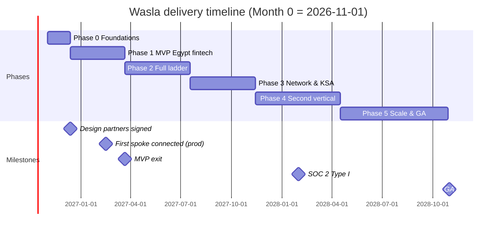

# 04 — Delivery Plan: Phases, Epics and Tasks

*Version 2.0 · October 8, 2026 · Companion to [01-prd.md](01-prd.md), [02-architecture.md](02-architecture.md), [03-services.md](03-services.md)*

Covers the whole project from kickoff to **end of project at Month 24** (GA in two countries, two verticals, scale targets met).

---

## 1. How to read this plan

- **Phases** have a goal, scope, team, exit criteria and a list of **epics**.
- **Epics** group **tasks**. Each task has: ID, description, service (S-number from [03-services.md](03-services.md)), owner role, estimate in person-weeks (pw), dependencies.
- **Roles:** TL = tech lead/architect · BE = backend (TypeScript) · GO = Go engineer · AI = AI/agent engineer (Python) · FE = frontend · SRE = platform/SRE · SEC = security engineer · IE = integration engineer · QA = quality engineer · PM = product manager · UX = product designer · DOM = domain expert (fintech/tax).
- Estimates are planning numbers for sizing, not commitments; re-estimate at each phase start.

### 1.1 Timeline

### 1.2 Team ramp

| Role | P0 | P1 | P2 | P3 | P4 | P5 |
|---|---|---|---|---|---|---|
| TL | 1 | 1 | 1 | 1 | 1 | 1 |
| BE | 2 | 3 | 4 | 5 | 5 | 5 |
| GO | 1 | 1 | 2 | 2 | 2 | 2 |
| AI | 1 | 1 | 2 | 2 | 3 | 3 |
| FE | 1 | 2 | 2 | 2 | 3 | 3 |
| SRE | 1 | 1 | 1 | 2 | 2 | 2 |
| SEC | 0 | 0 | 0.5 | 1 | 1 | 1 |
| IE | 0 | 1 | 2 | 2 | 3 | 3 |
| QA | 0 | 1 | 1 | 1 | 1 | 1 |
| PM | 1 | 1 | 1 | 1 | 1 | 1 |
| UX | 0.5 | 1 | 1 | 1 | 1 | 1 |
| DOM | 0.5 | 0.5 | 0.5 | 1 | 1 | 1 |
| **Total** | **9** | **13.5** | **18** | **21** | **24** | **24** |

### 1.3 Definition of done (every task)
Code reviewed and merged · unit + integration tests · contracts updated (OpenAPI/AsyncAPI) · telemetry (traces, metrics, logs) · tenant/region propagation · authz checks · PII masking verified · feature flag if user-facing · docs/runbook updated · deployed to staging · acceptance criteria demoed.

### 1.4 Rituals
2-week sprints · sprint demo with design partners (from Phase 1) · weekly architecture review (ADRs) · monthly security review · phase-exit review with go/no-go.

---

## 2. Phase 0 — Foundations (Weeks 0–6)

**Goal:** platform skeleton running in staging; canonical model and mapping proven on real data; design partners signed.

**Exit criteria**
- Staging cell up with CI/CD, observability, IAM, Tenant, KMS, Audit, Canonical Model Registry, LLM Gateway, Agent Runtime.
- Embedded-finance canonical model v0 (~8 entities) published.
- Mapping prototype maps Odoo API + sample SQL DB + ETA to the canonical model; 10 hub reads return 100% correct canonical records, p95 < 2 s.
- Mapping agent ≥ 80% field accuracy on the 3 sample sources.
- 1–2 Egyptian fintech hubs signed as design partners with ≥ 20 spokes each identified.

### E0.1 Product & discovery
| ID | Task | Svc | Role | pw | Dep |
|---|---|---|---|---|---|
| T0.1.1 | Interview 8–10 fintechs (lenders, BNPL, collections); document data needs per use case | — | PM, DOM | 3 | — |
| T0.1.2 | Interview 15 merchants and survey design-partner merchants; classify each by case A–F (PRD §2.1) and per data type; measure the real distribution | — | PM, UX | 2 | — |
| T0.1.3 | Define MVP data products: Merchant Profile, Sales History, Issued E-Invoices, Customers, Payment Status write-back | — | PM, DOM | 1 | T0.1.1 |
| T0.1.4 | Sign design-partner agreements (scope, data processing addendum, success criteria) | — | PM | 2 | T0.1.1 |
| T0.1.5 | Pricing hypothesis validation with 5 hubs | — | PM | 1 | T0.1.1 |
| T0.1.6 | Legal review: data processing, consent text (AR/EN), ETA access delegation, residency | — | PM | 1 | — |
| T0.1.7 | UX research: Connect flow paper prototypes tested with 6 merchants | — | UX | 2 | T0.1.2 |

### E0.2 Engineering foundations
| ID | Task | Svc | Role | pw | Dep |
|---|---|---|---|---|---|
| T0.2.1 | Monorepo setup (layout per architecture §13), build tooling for TS/Py/Go, code owners | — | TL | 1 | — |
| T0.2.2 | CI pipeline: lint, test, build, SAST, dependency scan, SBOM, image signing | — | SRE | 1.5 | T0.2.1 |
| T0.2.3 | Service kit TS: config, logging, tracing, metrics, health, auth middleware, tenant context, errors (RFC 9457) | — | BE | 2 | T0.2.1 |
| T0.2.4 | Service kit Python (same features) | — | AI | 1.5 | T0.2.1 |
| T0.2.5 | Service kit Go (same features) | — | GO | 1.5 | T0.2.1 |
| T0.2.6 | Events libraries (TS, Py, Go): Postgres outbox + relay to JetStream, durable pull consumers, inbox/dedup, DLQ subjects, event envelope schema (ADR-011) | — | BE, GO | 2 | T0.2.3 |
| T0.2.7 | Contracts package: OpenAPI/AsyncAPI layout, client generation | — | BE | 1 | T0.2.1 |
| T0.2.8 | `durable` library: Temporal wrappers, activity conventions, retry presets | — | BE | 1.5 | T0.3.4 |
| T0.2.9 | Policy (authz) library: RBAC + tenant + scope checks, deny-by-default | — | TL | 1.5 | T0.2.3 |
| T0.2.10 | Write ADR-001…010 | — | TL | 1 | — |
| T0.2.11 | Local dev environment (compose/kind), seed data, make targets | — | SRE | 1 | T0.2.1 |

### E0.3 Infrastructure (staging cell)
| ID | Task | Svc | Role | pw | Dep |
|---|---|---|---|---|---|
| T0.3.1 | Select Egypt hosting provider meeting residency; contract | — | SRE, PM | 1 | T0.1.6 |
| T0.3.2 | IaC: network, Kubernetes cluster, node pools, storage classes | — | SRE | 2 | T0.3.1 |
| T0.3.3 | PostgreSQL HA with PITR, per-service schemas, RLS conventions | — | SRE | 1 | T0.3.2 |
| T0.3.4 | Temporal cluster (Postgres persistence), cache, object storage | — | SRE | 1.5 | T0.3.2 |
| T0.3.8 | NATS JetStream cluster (3 nodes, TLS, accounts per environment), streams per domain, monitoring, backup/restore of stream data | — | SRE | 1.5 | T0.3.2 |
| T0.3.5 | GitOps repos per environment; progressive delivery controller | — | SRE | 1 | T0.3.2 |
| T0.3.6 | Observability platform: collectors, metrics/logs/traces stores, dashboards, alerting (S50) | S50 | SRE | 2 | T0.3.2 |
| T0.3.7 | Secrets bootstrap: root key provider for KMS | S07 | SRE | 0.5 | T0.3.2 |

### E0.4 Platform core services
| ID | Task | Svc | Role | pw | Dep |
|---|---|---|---|---|---|
| T0.4.1 | API Gateway v0: routing, TLS, JWT validation, rate limits, request ids | S01 | GO | 2 | T0.2.5 |
| T0.4.2 | IAM v0: users, orgs membership, password login, JWT/JWKS, invitations, roles (fixed) | S04 | BE | 3 | T0.2.3 |
| T0.4.3 | Tenant & Party v0: organizations, workspaces, environments, directory | S05 | BE | 2 | T0.2.3 |
| T0.4.4 | KMS v0: key hierarchy, encrypt/decrypt, secret store, internal CA | S07 | GO | 3 | T0.3.7 |
| T0.4.5 | Audit v0: ingest, hash chain, tenant query | S09 | GO | 1.5 | T0.2.6 |

### E0.5 Canonical model & mapping prototype
| ID | Task | Svc | Role | pw | Dep |
|---|---|---|---|---|---|
| T0.5.1 | Canonical model format: JSON Schema conventions, identity keys, state machines, tracked fields | S25 | TL | 0.5 | — |
| T0.5.2 | Embedded-finance canonical model v0 (~8 entities) with docs and examples (AR/EN) | — | DOM, TL | 2 | T0.1.3, T0.5.1 |
| T0.5.3 | Canonical Model Registry v0: validate, publish, version, lookup | S25 | BE | 1.5 | T0.5.1 |
| T0.5.4 | CM schema v0: OpenAPI 3.1 + `x-wasla-*` extensions; JSON Schema for validation | S24 | TL | 1 | — |
| T0.5.5 | Hand-build CMs for Odoo (API), sample SQL DB, ETA e-invoice schema | — | IE*, TL | 1 | T0.5.4 |
| T0.5.6 | Mapping format v0: source operations, filter translation, field expressions, enum maps, conversions | S26 | TL | 1 | T0.5.1 |
| T0.5.7 | Expression language v0 (JSONata-compatible syntax) + conversions (currency, dates, units) | S27 | BE | 2 | — |
| T0.5.8 | Hand-write mappings for the 3 sources (golden reference) | — | IE*, DOM | 1 | T0.5.5, T0.5.6 |
| T0.5.9 | CDS prototype: source selection, filter translation, execution, mapping, CDM validation, source metadata | S27 | BE | 3 | T0.5.7, T0.5.8 |
| T0.5.10 | Prototype adapters: HTTP (Odoo), SQL (direct in staging), ETA sandbox | S20 | BE | 1.5 | — |
| T0.5.11 | Run 10 hub reads; measure correctness and latency; report | — | TL | 0.5 | T0.5.9 |
| T0.5.12 | Mapping agent prototype: field candidates + LLM proposals; accuracy vs T0.5.8 | S26 | AI | 2 | T0.6.1 |

\*IE joins at end of Phase 0; TL covers before.

### E0.6 AI platform base
| ID | Task | Svc | Role | pw | Dep |
|---|---|---|---|---|---|
| T0.6.1 | LLM Gateway v0: provider routing, logging, cost tracking, caching | S40 | AI | 1.5 | T0.2.4 |
| T0.6.2 | PII Guard v0: detectors (names, phones, national ids, tax ids, IBAN, emails, addresses, AR/EN), masking/tokenization | S40 | AI | 2 | T0.6.1 |
| T0.6.3 | Agent Runtime v0: agent definitions, tools via internal APIs, decision log, prompt registry | S41 | AI | 1.5 | T0.6.1 |

### E0.7 Design
| ID | Task | Svc | Role | pw | Dep |
|---|---|---|---|---|---|
| T0.7.1 | Design system foundations: tokens, typography (Arabic + Latin), RTL components | — | UX, FE | 2 | — |
| T0.7.2 | Connect flow hi-fi designs for T1, T3, T6, T7 paths | — | UX | 1.5 | T0.1.7 |
| T0.7.3 | Hub Console IA and key screens wireframes | — | UX | 1 | T0.1.3 |
| T0.7.4 | Frontend app shell: auth, routing, i18n, RTL, API client | — | FE | 2 | T0.7.1 |

---

## 3. Phase 1 — MVP: Egypt fintech hub (Weeks 6–20)

**Goal:** first hub in production with the highest-priority cases (F, D, A) plus a micro-app pilot, canonical data reads, durable runs, and reconciliation.

**Exit criteria**
- 1 hub live; ≥ 20 spokes connected using ≥ 3 tiers (T6, T7, T1, T8b pilot available).
- Data products live: Merchant Profile, Sales History, Issued E-Invoices, Customers, Bank Lines, Payment Status back to merchants (notifications; writes into micro-apps).
- Micro-app pilot running with 20–30 merchants from cases D/E; 60-day retention measured (go/expand if ≥ 40%).
- ≥ 60% fields auto-mapped above threshold; median spoke onboarding < 1 day.
- ≥ 99.5% run success after retries; ≥ 99% agreement score on reconciled objects.
- Production cell live in Egypt with backups, on-call, runbooks; external pen test passed (no high findings open).

### E1.1 Production environment & operations
| ID | Task | Svc | Role | pw | Dep |
|---|---|---|---|---|---|
| T1.1.1 | Production cell IaC (separate account/project), sandbox environment | — | SRE | 2 | T0.3.* |
| T1.1.2 | Backups, PITR drills, restore runbook (RPO 5 min, RTO 1 h) | — | SRE | 1 | T1.1.1 |
| T1.1.3 | SLOs per service + burn-rate alerts; on-call rotation and paging | S50 | SRE | 1 | T0.3.6 |
| T1.1.4 | Status page | S50 | SRE | 0.5 | T1.1.1 |
| T1.1.5 | Incident process, postmortem template, severity matrix | — | TL, SRE | 0.5 | — |
| T1.1.6 | Load test harness (synthetic tenants, runs, queries) | — | QA | 1.5 | T1.6.* |

### E1.2 Identity, tenancy, consent
| ID | Task | Svc | Role | pw | Dep |
|---|---|---|---|---|---|
| T1.2.1 | IAM: MFA (TOTP), magic link, API keys (scoped, per env), service identities | S04 | BE | 2 | T0.4.2 |
| T1.2.2 | IAM: break-glass JIT staff access with approval + audit | S04 | BE | 1 | T1.2.1 |
| T1.2.3 | Tenant: hub–spoke links, spoke dedup by tax id, invitations | S05 | BE | 1.5 | T0.4.3 |
| T1.2.4 | Consent service: requests, grant/revoke/narrow, evaluate API with cache, expiry jobs | S06 | BE | 3 | T1.2.3 |
| T1.2.5 | Consent text and scopes UI copy (AR/EN) with legal | — | PM, UX | 0.5 | T0.1.6 |
| T1.2.6 | Region & Country Pack v1: Egypt pack (tax id validators, EGP, calendar, ETA binding, residency) | S08 | BE, DOM | 1.5 | — |
| T1.2.7 | Postgres RLS enforcement tests across all services | — | QA | 1 | T0.2.9 |

### E1.3 Connections and shared sources
| ID | Task | Svc | Role | pw | Dep |
|---|---|---|---|---|---|
| T1.3.1 | Connection service: model, lifecycle state machine, credential capture → KMS | S12 | BE | 2 | T0.4.4 |
| T1.3.2 | OAuth 2.0 flows (auth code, PKCE, client credentials), refresh scheduler | S12 | BE | 1.5 | T1.3.1 |
| T1.3.3 | Known-systems catalog v1: Odoo, Zoho Books, QuickBooks Online, Dynamics 365 BC + 3 local Egyptian ERPs (auth templates, CM templates) | S12 | IE | 3 | T1.3.1 |
| T1.3.4 | Health checks and degraded/paused handling | S12 | BE | 1 | T1.3.1 |
| T1.3.12 | Webhook Ingress: per-connection endpoints, signature verification, persist-then-ack, dedup | S02 | GO | 1.5 | T0.2.6 |
| T1.3.13 | Connector Runtime: HTTP/REST adapter, auth injection, pagination strategies, retries, breaker, rate limits | S20 | BE | 3 | T1.3.1 |
| T1.3.15 | Connector Runtime: document-dataset adapter (T7 records as operations) | S20 | BE | 1 | T1.4.6 |
| T1.3.16 | ETA connector: auth, document search, document details, status; CM + mapping template to the canonical model | S21 | BE, DOM | 2.5 | T1.3.13 |
| T1.3.17 | Bank statement ingestion (MT940/CAMT/CSV/Excel) as T6/T7 source | S21 | BE | 2 | T1.4.4 |
| T1.3.18 | Hub-data connector: ingest the fintech's own records per merchant (transactions, collections) as a T6 source | S21 | BE, IE | 1.5 | T1.3.13 |

### E1.4 Discovery & ingestion
| ID | Task | Svc | Role | pw | Dep |
|---|---|---|---|---|---|
| T1.4.1 | Discovery Orchestrator: workflow per connection, tier selection rules per entity, merge to CM, status events | S13 | BE | 3 | T0.2.8 |
| T1.4.2 | Spec Ingestor: OpenAPI 2/3 parse/normalize, Postman → OpenAPI, pagination/auth/error inference | S14 | BE | 2.5 | T0.5.4 |
| T1.4.4 | Document Extractor: upload endpoint, Excel/CSV structure detection (AR/EN headers), typed records + confidence | S19 | AI | 3 | T0.6.3 |
| T1.4.5 | Document Extractor: per-spoke template learning (no LLM on repeat layouts) | S19 | AI | 1.5 | T1.4.4 |
| T1.4.6 | T7 dataset model: versioned record sets per connection exposed as CM | S19, S24 | BE | 1 | T1.4.4 |
| T1.4.7 | Scheduled re-discovery + CM diff trigger | S13 | BE | 1 | T1.5.2 |

### E1.5 Canonical data in production
| ID | Task | Svc | Role | pw | Dep |
|---|---|---|---|---|---|
| T1.5.1 | CM Registry: versions, validation, operations/field indexes, query APIs | S24 | BE | 2.5 | T0.5.4 |
| T1.5.2 | CM diff + change classification (additive/breaking/mapping-affecting) | S24 | BE | 1.5 | T1.5.1 |
| T1.5.3 | Canonical model v1 for embedded finance (~20 entities, state machines for Invoice, Payment) | S25 | DOM, TL | 3 | T0.5.2 |
| T1.5.4 | Canonical Model Registry: compatibility checks, embeddings per entity/field | S25 | BE | 1 | T0.5.3 |
| T1.5.5 | Mapping service: production pipeline (candidates, agent proposals, confidence, thresholds, review items) | S26 | AI | 3 | T0.5.12 |
| T1.5.6 | Mapping templates per known system; reuse across spokes; learning from confirmations | S26 | AI, IE | 2 | T1.5.5 |
| T1.5.7 | CDS v1: production hardening (timeouts, fallbacks, clear unavailable-entity errors) | S27 | BE | 2.5 | T0.5.9 |
| T1.5.8 | CDS: consent check integration | S27 | BE | 1 | T1.2.4 |
| T1.5.9 | CDS: cache with TTL per tier + invalidation on events | S27 | BE | 1 | T1.5.7 |
| T1.5.10 | CDS: filters, pagination, get by id across adapters | S27 | BE | 1.5 | T1.5.7 |
| T1.5.11 | CDS: writes with reverse mapping, dry-run and idempotency (micro-app target in MVP) | S27 | BE | 2 | T1.5.7 |
| T1.5.12 | Expression language v1 + conversions (dated FX rates, units, time zones, enum maps) | S27 | BE | 1.5 | T0.5.7 |

### E1.6 Integration runtime
| ID | Task | Svc | Role | pw | Dep |
|---|---|---|---|---|---|
| T1.6.1 | Integration Spec schema v1 (YAML + JSON Schema): triggers, steps, reliability, SLA, reconciliation | S28 | TL | 1 | — |
| T1.6.2 | Spec Service: CRUD, versions in Git, validation, approval workflow (two-party), activation/pause/rollback | S28 | BE | 3 | T1.6.1 |
| T1.6.3 | Data-product templates (5 MVP products) auto-instantiated per spoke | S28 | BE, DOM | 2 | T1.6.2 |
| T1.6.4 | Spec Compiler: YAML → IR, static checks, recon config, test plan | S30 | BE | 2 | T1.6.1 |
| T1.6.5 | Orchestration: interpreter workflow, activities (find, write, convert, ledger, notify) | S31 | BE | 3 | T1.6.4, T0.2.8 |
| T1.6.6 | Orchestration: triggers (webhook, schedule, poll, API), per-key ordering, concurrency limits | S31 | BE | 2 | T1.6.5 |
| T1.6.7 | Orchestration: retries, timeouts, DLQ, pause/resume | S31 | BE | 1.5 | T1.6.5 |
| T1.6.8 | Run History: runs/steps storage (partitioned), masked payloads, search, replay single/bulk, DLQ views | S32 | BE | 2.5 | T1.6.5 |
| T1.6.9 | Verification: mocks from CMs, contract tests, golden tests, go-live gate | S33 | BE, QA | 3 | T1.6.4 |

### E1.7 Agreement
| ID | Task | Svc | Role | pw | Dep |
|---|---|---|---|---|---|
| T1.7.1 | State Ledger: objects, transitions (append-only, partitioned, hash-chained), observations, APIs | S34 | GO | 3 | T0.2.5 |
| T1.7.2 | State machine definitions from canonical model entities; validation of transitions | S34 | GO | 1 | T1.5.3 |
| T1.7.3 | Reconciler v1: scheduled jobs, cursoring, batch fetch via CDS, compare with tolerance, breaks (missing, state, stale) | S36 | BE | 3 | T1.7.1, T1.5.7 |
| T1.7.4 | Auto-heal (replay/resync) for allowed break types | S36 | BE | 1 | T1.7.3 |
| T1.7.5 | Agreement score computation and API | S36 | BE | 1 | T1.7.3 |
| T1.7.6 | Breaks & Cases: records, evidence, shared inbox, assignment, comments, resolution actions | S37 | BE | 2.5 | T1.7.3 |

### E1.8 Hub developer surface
| ID | Task | Svc | Role | pw | Dep |
|---|---|---|---|---|---|
| T1.8.1 | Hub Public API v1: spokes, invitations, connections, consents, canonical data (read/write, dry-run), integrations, runs, objects, breaks, agreement | S45 | BE | 3 | many |
| T1.8.2 | Outbound webhooks: endpoints, signing, retries 72 h, delivery log, replay | S45 | BE | 1.5 | T1.8.1 |
| T1.8.3 | SDKs: TypeScript and Python (generated + helpers for canonical data reads/writes) | S45 | BE | 1.5 | T1.8.1 |
| T1.8.4 | Developer portal: guides, reference, events, canonical model browser, sandbox keys | S48 | FE, PM | 2 | T1.8.1 |

### E1.9 Experiences
| ID | Task | Svc | Role | pw | Dep |
|---|---|---|---|---|---|
| T1.9.1 | Connect Service: sessions, invite links, flow state machine, theming | S47 | BE | 2 | T1.2.4 |
| T1.9.2 | Connect UI: landing, consent, system picker, T1 OAuth/API key flows | S47 | FE | 2.5 | T1.9.1 |
| T1.9.4 | Connect UI: T6 ETA authorization flow | S47 | FE | 1 | T1.3.16 |
| T1.9.5 | Connect UI: T7 upload/inbox flow | S47 | FE | 1 | T1.4.4 |
| T1.9.6 | `connect.js` embeddable loader + hosted pages; mobile responsive | S47 | FE | 1.5 | T1.9.2 |
| T1.9.7 | Console BFF: sessions, aggregation, SSE live updates | S46 | BE | 2 | T1.2.1 |
| T1.9.8 | Hub Console: overview, spokes, connections, data products, integrations, runs/DLQ, breaks, webhooks, API keys, team | — | FE | 6 | T1.9.7 |
| T1.9.9 | Spoke Portal: connections, hubs & consent, breaks involving me, team | — | FE | 3 | T1.9.7 |
| T1.9.10 | Studio: mapping review queue, mapping templates, discovery review, document review, tenants, canonical model viewer | — | FE | 3 | T1.9.7 |
| T1.9.11 | Notification service: email + WhatsApp templates, in-app inbox, preferences | S10 | BE | 2 | T0.2.6 |
| T1.9.12 | Usability tests of Connect with 8 merchants; fixes | — | UX, FE | 1.5 | T1.9.6 |

### E1.10 AI quality
| ID | Task | Svc | Role | pw | Dep |
|---|---|---|---|---|---|
| T1.10.1 | Evaluation service: datasets, runs, metrics, CI regression gates | S42 | AI | 2 | T0.6.3 |
| T1.10.2 | Golden datasets: mappings (500+ fields), DB entity inference, Excel extraction (100 files) | — | IE, AI | 2 | T1.10.1 |
| T1.10.3 | Cost dashboards per tenant/agent; budgets | S40 | AI | 0.5 | T0.6.1 |

### E1.11 Billing (metering only)
| ID | Task | Svc | Role | pw | Dep |
|---|---|---|---|---|---|
| T1.11.1 | Metering: usage events from gateway, runtime, CDS, recon; daily aggregates; usage API | S11 | BE | 1.5 | T0.2.6 |

### E1.13 Micro-app pilot (T8b) and write-back by notification
| ID | Task | Svc | Role | pw | Dep |
|---|---|---|---|---|---|
| T1.13.1 | Pilot scope with hub: one narrow app on the hub's flow (invoices, receivables, collections) and the merchant benefit the hub offers | — | PM, DOM | 0.5 | T0.1.3 |
| T1.13.2 | App model: canonical entities → screens (lists, forms, details, status), simple roles | S39 | BE | 2 | T1.5.3 |
| T1.13.3 | Runtime: per-app storage, CRUD APIs, validation from the canonical model, audit | S39 | BE | 2.5 | T1.13.2 |
| T1.13.4 | Mobile-first PWA (AR/EN), WhatsApp deep links and notifications | S39 | FE | 3 | T1.13.2 |
| T1.13.5 | Start from Excel: import the merchant's uploaded file into the app (no blank start) | S39, S19 | BE | 1 | T1.4.4 |
| T1.13.6 | App data exposed as T1 capability with generated CM and mapping | S39, S24 | BE | 1 | T1.13.3 |
| T1.13.7 | Write-back into the app (payment status, settlements) via CDS | S27, S39 | BE | 1 | T1.5.11 |
| T1.13.8 | Write-back by notification for all other merchants (webhook/email/WhatsApp) | S10, S31 | BE | 1 | T1.9.11 |
| T1.13.9 | Connect path "use the app instead of Excel" | S47 | FE | 1 | T1.13.4 |
| T1.13.10 | Run pilot with 20–30 merchants; measure 60-day retention and data quality vs Excel | — | PM, IE | 3 | all |

### E1.12 Security & launch
| ID | Task | Svc | Role | pw | Dep |
|---|---|---|---|---|---|
| T1.12.1 | Threat model (STRIDE) for Connect, CDS, KMS, micro-apps | — | TL | 1 | — |
| T1.12.2 | Security hardening checklist (ASVS L2) per service | — | TL, BE | 1.5 | T1.12.1 |
| T1.12.3 | External pen test (web, API, micro-apps); fix high/critical | — | TL | 2 | all |
| T1.12.5 | Design partner onboarding: hub integration workshop, first 5 spokes white-glove | — | IE, PM | 2 | all |
| T1.12.6 | Scale to 20+ spokes; collect metrics; MVP exit review | — | PM, IE | 3 | T1.12.5 |

---

## 4. Phase 2 — On-prem, websites and human tasks (Weeks 20–37)

**Goal:** reach on-prem databases (Edge Agent), turn websites into APIs, add human tasks, expand micro-apps if the pilot passed; money ledger; automated operations. Second and third hubs live.

**Exit criteria**
- 3 hubs live; ≥ 150 spokes; T3 (Edge Agent), T5 (website → API) and T8a used in production.
- ≥ 3 website site profiles live, each reused by ≥ 10 merchants; read success ≥ 99% after self-healing.
- Micro-apps expanded (if pilot passed) to ≥ 100 merchants; write-back via T1 APIs live.
- Money Ledger live for payment status and settlements; orphan-money matching ≥ 90% auto.
- Ops Agent proposals accepted ≥ 60%; MTTR for drift < 4 h.
- ≥ 70% fields auto-mapped.

### E2.0 Edge Agent and on-prem databases (cases B and C, T3) — moved from Phase 1
| ID | Task | Svc | Role | pw | Dep |
|---|---|---|---|---|---|
| T2.0.0 | Spike (1 week): NATS leaf nodes / request-reply as Edge Agent transport vs in-house Tunnel Gateway; decide and adjust T2.0.1–T2.0.5 | S03, S22 | GO, TL | 1 | T0.3.8 |
| T2.0.1 | Tunnel Gateway: mTLS, HTTP/2 streams, registry, routing, heartbeats | S03 | GO | 3 | T2.0.0 |
| T2.0.2 | Edge Agent: enrollment (token → CSR → cert), tunnel client, reconnect/backoff | S22 | GO | 2 | T2.0.1 |
| T2.0.3 | Edge Agent: signed command router + local policy (allow-list, read-only, row limits) | S22 | GO | 1.5 | T2.0.2 |
| T2.0.4 | Edge Agent: SQL Server, MySQL, PostgreSQL drivers; query execution with streaming | S22 | GO | 2 | T2.0.3 |
| T2.0.5 | Edge Agent: encrypted local buffer + outbox | S22 | GO | 1 | T2.0.2 |
| T2.0.6 | Edge Agent: auto-update (signed, staged, rollback), Windows service + systemd packaging, installer one-liner | S22 | GO, SRE | 2 | T2.0.2 |
| T2.0.7 | Edge Agent: local status page + local audit log + diagnostics bundle | S22 | GO | 1 | T2.0.3 |
| T2.0.8 | Connector Runtime: SQL-via-Edge adapter | S20 | BE | 1 | T2.0.4 |
| T2.0.9 | DB Introspector: schema, keys, samples (masked), entity inference, PII detection, generated read ops | S16 | AI | 3 | T2.0.4 |
| T2.0.10 | Connect UI: T3 Edge Agent install and enrollment flow with live status | S47 | FE | 1.5 | T2.0.2 |
| T2.0.11 | Edge Agent security whitepaper for spoke IT (AR/EN) | — | TL, PM | 0.5 | T2.0.7 |

### E2.1 Website → API (T5) and remaining ingestion
| ID | Task | Svc | Role | pw | Dep |
|---|---|---|---|---|---|
| T2.1.1 | Browser helper: guided recording of a merchant session with consent and PII redaction; HAR upload | S18 | FE, AI | 2 | — |
| T2.1.2 | Traffic analysis: request chains, auth/session, CSRF; prefer internal network calls over screen clicks | S18 | AI | 3 | T2.1.1 |
| T2.1.3 | Site profiles: one reusable profile per website/platform, shared by all merchants on it | S18 | AI, BE | 2 | T2.1.2 |
| T2.1.4 | Headless browser runner (isolated) for flows that need screen automation | S18 | GO | 2.5 | T2.1.2 |
| T2.1.5 | Session vault: credentials in KMS, session refresh, OTP/captcha requested from the merchant via WhatsApp | S18, S07, S38 | BE | 2 | T2.3.2 |
| T2.1.6 | Self-healing: synthetic checks per profile, change detection, agent re-derives the profile, review before rollout | S18, S44 | AI | 3 | T2.1.3 |
| T2.1.7 | Read-only first; per-site legal/ToS review checklist before enabling a profile | — | PM | 0.5 | — |
| T2.1.8 | Code Sandbox: isolation runtime, limits, artifact I/O, network allow-list (used by `code` steps and browser runner) | S43 | GO | 3 | — |
| T2.1.10 | Document Extractor: PDF + image OCR (AR/EN), email inbox ingestion | S19 | AI | 3 | T1.4.4 |
| T2.1.11 | Spec Ingestor: GraphQL introspection, WSDL/SOAP | S14 | BE | 2 | T1.4.2 |
| T2.1.12 | Connector Runtime: GraphQL and SOAP adapters | S20 | BE | 1.5 | T2.1.11 |
| T2.1.13 | Discovery: tier upgrade detection + migration with recon check | S13 | BE | 2.5 | T1.4.1 |
| T2.1.14 | Edge Agent: Oracle driver, file watcher (shared folders), CDC (log-based SQL Server/MySQL/Postgres + watermark polling) | S22 | GO | 4 | T2.0.4 |
| T2.1.15 | CDC events → Orchestration triggers; CDS cache invalidation | S31, S27 | BE | 1 | T2.1.14 |
| T2.1.16 | Connect UI: website (T5) and human-task (T8a) paths | S47 | FE | 2 | above |
| T2.1.17 | CDS writes to T1 APIs (approved write-back into cloud ERPs) | S27 | BE | 1.5 | T1.5.11 |

### E2.2 Micro-apps expansion (only if the pilot passed)
| ID | Task | Svc | Role | pw | Dep |
|---|---|---|---|---|---|
| T2.2.1 | More screens and entities based on pilot feedback (still limited to the hub's flows) | S39 | BE, FE | 3 | T1.13.10 |
| T2.2.2 | Import/export (Excel), bulk edit, offline drafts | S39 | FE, BE | 2 | T1.13.3 |
| T2.2.3 | Upgrades on canonical model changes (migrations) | S39 | BE | 1.5 | T1.13.3 |
| T2.2.4 | Spoke Portal: manage app users and roles | — | FE | 1 | T1.13.3 |

### E2.3 Human-as-API (T8a)
| ID | Task | Svc | Role | pw | Dep |
|---|---|---|---|---|---|
| T2.3.1 | Human Task service: task schema, lifecycle, signals to Orchestration | S38 | BE | 2.5 | T1.6.5 |
| T2.3.2 | WhatsApp Business provider integration (templates, inbound webhooks, media) | S10, S38 | BE | 2 | T1.9.11 |
| T2.3.3 | Mobile short forms (typed fields, uploads, AR/EN) | S38 | FE | 2 | T2.3.1 |
| T2.3.4 | Reply parser: free text/voice-note transcript/file → typed values + confidence; clarification loop | S38 | AI | 3 | T2.3.1 |
| T2.3.5 | Reminders, escalation, SLAs per task | S38 | BE | 1 | T2.3.1 |
| T2.3.6 | Spec `human` step + Connector Runtime human-backed adapter | S30, S20 | BE | 1.5 | T2.3.1 |
| T2.3.7 | Spoke Portal: tasks inbox | — | FE | 1 | T2.3.1 |

### E2.4 Money & reconciliation v2
| ID | Task | Svc | Role | pw | Dep |
|---|---|---|---|---|---|
| T2.4.1 | Money Ledger: accounts, multi-currency, balanced transactions, reversals, idempotency | S35 | GO | 4 | — |
| T2.4.2 | Money Ledger: balances as-of, snapshots, query APIs, Hub API exposure | S35 | GO | 2 | T2.4.1 |
| T2.4.3 | Posting templates in specs (`ledger:` block) + Orchestration activity | S30, S31 | BE | 1.5 | T2.4.1 |
| T2.4.4 | Reconciler: value_mismatch and orphan_money breaks; tolerances | S36 | BE | 2 | T1.7.3 |
| T2.4.5 | Payment matching: rules engine (amount, date, reference parsing) + agent suggestions | S36 | AI, BE | 3 | T2.4.4 |

### E2.5 Automated operations
| ID | Task | Svc | Role | pw | Dep |
|---|---|---|---|---|---|
| T2.5.1 | Ops Agent: incident clustering from failures, DLQ, drift, breaks | S44 | AI | 2.5 | — |
| T2.5.2 | Ops Agent: diagnosis using run history, CMs, mappings; proposals (re-map, spec patch, conversion fix, re-auth) | S44 | AI | 3 | T2.5.1 |
| T2.5.3 | Studio: proposals review/approve, apply as change requests | — | FE | 1.5 | T2.5.2 |
| T2.5.4 | Spec Service: auto-pause on breaking CM diff; resume + replay from pause point | S28, S32 | BE | 1.5 | T1.5.2 |
| T2.5.5 | Incident timeline per integration (Hub Console) | — | FE | 1 | T2.5.1 |

### E2.6 Integration authoring
| ID | Task | Svc | Role | pw | Dep |
|---|---|---|---|---|---|
| T2.6.1 | Designer Agent: intent → spec draft + fixtures + explanation; iterate on validation | S29 | AI | 3 | T1.6.4 |
| T2.6.2 | `code` step via Sandbox (TypeScript functions) | S31, S43 | BE | 1.5 | T2.1.8 |
| T2.6.3 | CLI: `wasla spec push/test/diff`, `wasla cdm validate/publish` | — | BE | 1.5 | T1.6.2 |
| T2.6.4 | Hub Console: spec editor with validation, diff, test report | — | FE | 2 | T1.6.9 |

### E2.7 Platform
| ID | Task | Svc | Role | pw | Dep |
|---|---|---|---|---|---|
| T2.7.1 | Search service: Arabic/English full text + vectors across tenant objects and canonical entities | S49 | BE | 2 | — |
| T2.7.2 | Evaluation datasets extended: docs, code ops, traffic, OCR, reply parsing | S42 | IE, AI | 2 | T1.10.1 |
| T2.7.3 | Performance: partition maintenance, query tuning, load test to 5M runs/month | — | SRE, QA | 2 | — |
| T2.7.4 | Hubs #2 and #3 onboarding; scale to 150 spokes | — | IE, PM | 4 | — |

---

## 5. Phase 3 — Network Effect & KSA (Weeks 37–54)

**Goal:** connections reused across hubs; proof of agreement; KSA region live; compliance and enterprise readiness.

**Exit criteria**
- 6 hubs (≥ 1 in KSA); ≥ 1,000 spokes; ≥ 20% of new hub–spoke connections reuse existing spokes.
- Proof-of-agreement exports used by ≥ 3 hubs.
- KSA cell live in-kingdom with ZATCA connector.
- SOC 2 Type I audit in progress (report by Month 15); SSO and custom roles available.
- Billing live (invoices, payments).

### E3.1 Network
| ID | Task | Svc | Role | pw | Dep |
|---|---|---|---|---|---|
| T3.1.1 | Spoke identity across hubs: dedup, merge flows, ownership verification (tax id + ETA proof) | S05 | BE | 2 | — |
| T3.1.2 | Consent reuse flow: new hub → incremental scopes only | S06, S47 | BE, FE | 2 | T3.1.1 |
| T3.1.3 | Connect: "already connected" fast path; < 5 min to ready | S47 | FE | 1 | T3.1.2 |
| T3.1.4 | Spoke Portal: all hubs, scopes per hub, revoke per hub, consent receipts | — | FE | 1.5 | T3.1.2 |
| T3.1.5 | Consent receipts (signed JSON/PDF) | S06 | BE | 1 | T0.4.4 |
| T3.1.6 | Proof-of-agreement export (signed report, per period, per counterparty) | S37 | BE | 2 | T1.7.5 |
| T3.1.7 | Agreement analytics for hubs (trend, by tier, by spoke) | — | FE | 1.5 | T1.7.5 |

### E3.2 KSA region
| ID | Task | Svc | Role | pw | Dep |
|---|---|---|---|---|---|
| T3.2.1 | Select in-kingdom hosting; legal/residency review | — | SRE, PM | 2 | — |
| T3.2.2 | KSA cell via IaC; region routing in directory; cross-region isolation tests | — | SRE | 3 | T3.2.1 |
| T3.2.3 | KSA country pack (VAT/CR formats, SAR, Hijri calendar support, holidays) | S08 | BE, DOM | 1.5 | — |
| T3.2.4 | ZATCA connector (Fatoora: e-invoice retrieval/clearance status as available to taxpayers) | S21 | BE, DOM | 3 | — |
| T3.2.5 | Gulf Arabic support in human tasks and reply parsing | S38 | AI | 1 | — |
| T3.2.6 | Known-systems catalog: KSA-popular ERPs/accounting (cloud + on-prem) | S12 | IE | 2 | — |
| T3.2.7 | LLM processing rules per region (in-region models where required) | S40 | AI | 1.5 | — |
| T3.2.8 | First KSA hub onboarding | — | IE, PM | 3 | all |

### E3.3 Enterprise & compliance
| ID | Task | Svc | Role | pw | Dep |
|---|---|---|---|---|---|
| T3.3.1 | SSO (OIDC/SAML) and SCIM provisioning | S04 | BE | 2.5 | — |
| T3.3.2 | Custom roles and permission editor | S04 | BE, FE | 2 | — |
| T3.3.3 | SOC 2 program: policies, controls mapping, evidence automation, auditor engagement | — | SEC | 8 | — |
| T3.3.4 | SIEM integration; anomaly detection on data access | — | SEC | 2 | — |
| T3.3.5 | Data deletion and export requests (per tenant, per spoke) | all | BE | 2 | — |
| T3.3.6 | Dedicated cell option for enterprise tenants | — | SRE | 2 | T3.2.2 |

### E3.4 Billing
| ID | Task | Svc | Role | pw | Dep |
|---|---|---|---|---|---|
| T3.4.1 | Plans, entitlements, limit enforcement | S11 | BE | 2 | T1.11.1 |
| T3.4.2 | Invoices (EG/SA tax compliant), local payment providers | S11 | BE | 2.5 | T3.4.1 |
| T3.4.3 | Usage & billing UI in Hub Console | — | FE | 1.5 | T3.4.1 |

### E3.6 Vendor partnerships
| ID | Task | Svc | Role | pw | Dep |
|---|---|---|---|---|---|
| T3.6.1 | Rank local ERP/accounting vendors by number of merchants across hubs (from survey + connection data) | — | PM, IE | 1 | — |
| T3.6.2 | Partnership program: terms, technical options (vendor API, vendor-hosted export, vendor-installed agent) | — | PM | 2 | T3.6.1 |
| T3.6.3 | Build vendor connectors + mapping templates for the top 3 vendors | S12, S26 | BE, IE | 6 | T3.6.2 |
| T3.6.4 | Migrate existing merchants of those vendors to the vendor connector (with recon check) | S13 | IE | 2 | T3.6.3 |

### E3.5 Quality & scale
| ID | Task | Svc | Role | pw | Dep |
|---|---|---|---|---|---|
| T3.5.1 | Mapping improvements (active learning, template coverage); target ≥ 80% auto | S26 | AI | 3 | — |
| T3.5.2 | CDS: automatic fallback ordering from observed latency/failures per connection | S27 | BE | 1 | — |
| T3.5.3 | Chaos game days (tunnel loss, DB failover, NATS node loss, Temporal loss) | — | SRE | 1 | — |
| T3.5.4 | Load test to 20M runs/month, 2,000 agents | — | SRE, QA | 2 | — |
| T3.5.5 | Hubs #4–#6 onboarding; scale to 1,000 spokes | — | IE, PM | 6 | — |

---

## 6. Phase 4 — Second Vertical (Weeks 54–76)

**Goal:** launch a second vertical on the same engine; extend micro-apps to the new vertical.

**Exit criteria**
- Micro-apps available in both verticals; ≥ 500 spokes using micro-apps.
- Second vertical (decided by Month 12: retail/distribution buyer or logistics/3PL) live with ≥ 1 hub and ≥ 50 spokes.
- 8 hubs; ≥ 5,000 spokes; ≥ 80% fields auto-mapped.

### E4.1 Micro-apps for the second vertical
| ID | Task | Svc | Role | pw | Dep |
|---|---|---|---|---|---|
| T4.1.1 | Micro-app templates for the vertical's flows (e.g. orders, deliveries) | S39 | BE, FE | 3 | T4.2.2 |
| T4.1.2 | Micro-app billing add-on | S11 | BE | 0.5 | T3.4.1 |

### E4.2 Second vertical
| ID | Task | Svc | Role | pw | Dep |
|---|---|---|---|---|---|
| T4.2.1 | Vertical discovery: interviews with 6 hubs, 15 spokes; data products | — | PM, DOM | 3 | — |
| T4.2.2 | Canonical model v1 for the vertical (~20 entities, state machines e.g. Order, Shipment, ASN, POD) | S25 | DOM, TL | 4 | T4.2.1 |
| T4.2.3 | Data-product templates for the vertical | S28 | BE, DOM | 2 | T4.2.2 |
| T4.2.4 | Known-systems catalog extensions (WMS/TMS/POS as relevant) | S12 | IE | 3 | T4.2.1 |
| T4.2.5 | Mapping templates and eval datasets for the vertical | S26, S42 | AI, IE | 2 | T4.2.2 |
| T4.2.6 | Marketplace/external sources relevant to the vertical (T6) | S21 | BE | 2 | T4.2.1 |
| T4.2.7 | Design partner hub onboarding in the vertical | — | IE, PM | 4 | above |

### E4.3 Platform evolution
| ID | Task | Svc | Role | pw | Dep |
|---|---|---|---|---|---|
| T4.3.1 | Self-hosted model option for sensitive tenants | S40 | AI, SRE | 3 | — |
| T4.3.2 | Additional SDKs: Java, .NET, PHP | S45 | BE | 3 | — |
| T4.3.3 | CDS change feed: push changed canonical records to hubs | S27 | BE | 3 | T2.1.15 |
| T4.3.4 | Multi-party integrations (> 2 parties, e.g. hub + spoke + bank) | S28, S34 | TL, BE | 3 | — |
| T4.3.5 | Load test to 35M runs/month, 3,500 agents | — | SRE, QA | 1.5 | — |

---

## 7. Phase 5 — Scale & GA Hardening (Weeks 76–104)

**Goal:** general availability: self-serve, ecosystem, scale and compliance targets.

**Exit criteria (= end of project)**
- All PRD goals G1–G7 met.
- SOC 2 Type II report; ISO 27001 readiness assessment complete.
- 50M runs/month, 20,000 spokes, 5,000 agents load-tested with SLOs met.
- 10+ paying hubs across Egypt and KSA, two verticals.
- Self-serve hub sign-up for Starter plan.

### E5.1 Self-serve & ecosystem
| ID | Task | Svc | Role | pw | Dep |
|---|---|---|---|---|---|
| T5.1.1 | Self-serve hub sign-up, sandbox auto-provisioning, guided first integration | S05, S47 | BE, FE | 3 | — |
| T5.1.2 | Public known-systems directory & verified connector listings | S12 | FE, IE | 2 | — |
| T5.1.3 | Partner program: implementation partners get Studio-lite access for their clients | S04, — | BE, FE | 3 | — |
| T5.1.4 | Mapping-template contributions workflow (partners submit templates for new systems; review) | S25 | BE, FE | 2 | — |
| T5.1.5 | Marketplace connectors (e-commerce platforms) as T6 | S21 | BE | 3 | — |

### E5.2 Scale
| ID | Task | Svc | Role | pw | Dep |
|---|---|---|---|---|---|
| T5.2.1 | Multi-cell per region; tenant rebalancing tooling | — | SRE | 4 | — |
| T5.2.2 | Ledger archiving & tiered storage; query federation over archive | S34, S35 | GO | 3 | — |
| T5.2.3 | Run history retention tiers; cost optimization | S32 | BE | 1.5 | — |
| T5.2.4 | Tunnel Gateway scale (5,000+ agents), regional edge points | S03 | GO | 2 | — |
| T5.2.5 | Final load and soak tests at Month-24 targets; capacity plan | — | SRE, QA | 3 | — |

### E5.3 Compliance & reliability
| ID | Task | Svc | Role | pw | Dep |
|---|---|---|---|---|---|
| T5.3.1 | SOC 2 Type II observation period and audit | — | SEC | 6 | T3.3.3 |
| T5.3.2 | ISO 27001 readiness | — | SEC | 4 | — |
| T5.3.3 | DR exercise: full region cell restore | — | SRE | 1.5 | — |
| T5.3.4 | Second external pen test; bug bounty launch | — | SEC | 2 | — |

### E5.4 Product completeness
| ID | Task | Svc | Role | pw | Dep |
|---|---|---|---|---|---|
| T5.4.1 | Accessibility audit and fixes (WCAG 2.1 AA) | — | FE, UX | 2 | — |
| T5.4.2 | Advanced analytics for hubs (connection funnel, data freshness, tier mix) | — | FE, BE | 2 | — |
| T5.4.3 | Agent quality push: mapping ≥ 85% auto, extraction ≥ 95% field accuracy | S26, S19 | AI | 4 | — |
| T5.4.4 | GA launch: pricing page, docs freeze, support playbooks, SLAs in contracts | — | PM | 2 | — |
| T5.4.5 | Hubs #9–#10+ onboarding; scale to 20,000 spokes | — | IE, PM | 8 | — |

---

## 8. Deferred backlog (not scheduled)

| Item | Why deferred | Trigger to schedule |
|---|---|---|
| T2 — Doc Reader (API docs → spec) | Rare among SMB merchants | ≥ 5 merchants/hubs with documented APIs and no OpenAPI |
| T4 — Code Analyzer (codebase → operations) | SMB merchants use packaged software and don't own code; DB access gives the same data | Large hubs or second-vertical counterparties with in-house systems; or safe write-back needs business logic |
| API generation from DB or code (S23) + Edge plugin host | Reading via Edge Agent is enough first | Write-back into on-prem systems required by ≥ 2 hubs |
| Verification fuzz tests for generated APIs | Depends on API generation | When API generation is scheduled |

## 9. Cross-phase workstreams

| Workstream | Activities | Owner |
|---|---|---|
| **Customer success** | Hub kickoff, spoke onboarding campaigns, white-glove for hard spokes, weekly reports to hubs | IE, PM |
| **Golden data** | Every confirmed mapping/extraction/fix flows (masked) into eval datasets | IE, AI |
| **Reuse ratio** | Track engineer minutes per spoke and % auto-mapped; any repeated manual fix → mapping template or rule | TL, IE |
| **Security** | Monthly review, dependency updates, secrets rotation, access reviews | SEC/TL |
| **Docs** | ADRs, runbooks, API docs, spoke-facing help (AR/EN) | All |
| **Cost** | Infra and LLM cost per spoke reviewed monthly | SRE, AI |

## 10. Key dependencies and risks to the schedule

| Dependency / risk | Affects | Mitigation |
|---|---|---|
| Design partner commitment and spoke access | Phase 1 exit | Sign before Week 6; data-sharing agreements early |
| ETA API access per spoke | T6 in MVP | Prepare delegation guide; fallback to T7 uploads of ETA exports |
| Egypt hosting meeting residency | P0 infra | Decide in Week 2; keep IaC provider-agnostic |
| WhatsApp provider approval | T8a | Start application in Phase 1 |
| Hiring ramp | All | Start hiring for Phase 2 roles in Phase 1 |
| Building everything in-house | Scope creep | Phase gates; cut non-P0 items before slipping exit dates |

## 11. Phase gate checklist (used at every phase exit)

- [ ] Exit criteria met with evidence (dashboards, reports)
- [ ] No open P0/P1 bugs; no high/critical security findings
- [ ] SLOs met for 4 consecutive weeks
- [ ] Runbooks and on-call coverage for new services
- [ ] Customer feedback reviewed; next-phase scope adjusted
- [ ] Cost per spoke within target
- [ ] Re-estimation of next phase completed
